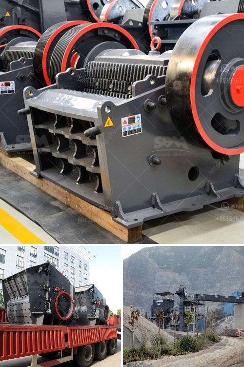

<h3>jaw crusher adalah</h3>
A jaw crusher adalah machine designed to break large rocks into smaller rocks, gravel, or rock dust. Jaw crushers may be used to reduce the size, or change the form, of waste materials so they can be more easily disposed of or recycled, or to reduce the size of a solid mix of raw materials as in rock ore, so that pieces of different composition can be differentiated. Crushing is the process of transferring a force amplified by mechanical advantage through a material made of molecules that bond together more strongly, and resist deformation more, than those in the material being crushed do.

Jaw crushers are heavy-duty machines and hence must be robustly constructed. The main frame is often made from cast iron or steel, connected with tie-bolts. It is commonly made in sections so that it can be transported underground for installation. Modern jaw crushers may have a main frame of welded mild steel plate.

The jaws are usually constructed from cast steel and fitted with replaceable liners, made from manganese steel, or "Ni-hard", a Ni-Cr alloyed cast iron. All jaw crushers come with two jaws, one of which is fixed while the other moves. The working principle of jaw crushers is based on the reciprocating movement of the movable jaw that compresses and crushes the rock or ore between its fixed and movable jaws.

The smallest jaw crusher is the MJ750, which is suitable for small-scale operations and is known for its durability, high productivity, and ease of use. It has a maximum jaw opening of 290 mm and a Jaw depth of 160 mm. The larger MJ1100 is capable of handling larger rocks and ore with a maximum opening of 760 mm and a depth of 480 mm.

Jaw crushers are widely used in various industries, such as mining, road and railway construction, building construction,water conservation and chemical industry, etc. They are an essential part of many industrial processes and can be used in aggregate production, ore processing, and recycling applications. The versatility and reliability of jaw crushers make them highly popular among industries that require efficient crushing of hard and abrasive materials.

In conclusion, a jaw crusher adalah a versatile and robust machine that is capable of reducing the size of various materials and has a wide range of applications in different industries. Whether it is for mining, construction, or recycling, jaw crushers provide an efficient and reliable solution for crushing hard and abrasive materials. They are an essential tool in any crushing operation and play a crucial role in ensuring the successful completion of various projects.
<h3>Contact us</h3><ul><li><strong>Whatsapp:&nbsp;<a href="https://wa.me/8613661969651">+8613661969651</a></strong></li><li><a href="https://swt.shibang-china.com/?git&amp;zhl&amp;jaw crusher adalah"><strong>Online Service(chat now)</strong></a></li></ul><h3>Related</h3><ul><li><a href='prices of sand making machine.md'>prices of sand making machine</a></li><li><a href='stone principle crusher project.md'>stone principle crusher project</a></li><li><a href='gold mining compressor price in south africa.md'>gold mining compressor price in south africa</a></li><li><a href='ball mill equipment 150 ton hr.md'>ball mill equipment 150 ton hr</a></li><li><a href='mobile rock crusher granulator jaw type ballitoville.md'>mobile rock crusher granulator jaw type ballitoville</a></li></ul>