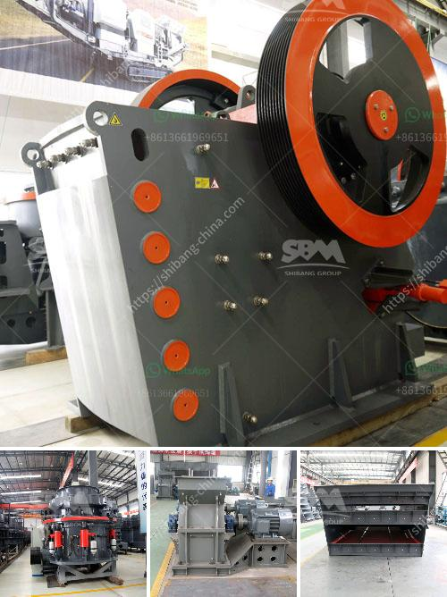

<h3>jaw crusher buatan philippines 250 ton hari</h3>
The mining industry plays a crucial role in the economic growth and development of any country. Being a labor-intensive sector, mining relies heavily on efficient machinery and equipment to extract valuable minerals from the earth. A jaw crusher, one of the key components in mining operations, has emerged as a game-changer in the mining industry. This article will explore the jaw crusher buatan Philippines 250 ton hari, highlighting its significance and impact on the sector.

The jaw crusher buatan Philippines 250 ton hari is a high-quality and efficient machine designed to crush rocks and minerals into smaller pieces. It operates on the principle of compression, where the materials are squeezed between two plates to reduce their size. With a capacity of 250 tons per day, this jaw crusher has revolutionized the mining industry in the Philippines, allowing for more efficient and productive operations.

The introduction of the jaw crusher buatan Philippines 250 ton hari has significantly improved the efficiency and productivity of mining operations in the country. Traditional methods of ore extraction required manual breaking, which was time-consuming and labor-intensive. With the jaw crusher, large rocks are efficiently crushed into smaller sizes, enabling a smoother extraction process. This has led to increased productivity, reduced operational costs, and improved overall efficiency in mining operations.

The jaw crusher buatan Philippines 250 ton hari is built to last. Its robust design and high-quality construction materials make it durable and reliable even in harsh mining environments. This machine can withstand heavy loads and consistently deliver high-performance results, making it a valuable asset for mining companies. Its dependability ensures uninterrupted operations and minimal downtime, thereby optimizing productivity and profitability.

One of the key advantages of the jaw crusher buatan Philippines 250 ton hari is its versatility in handling different types of materials. It can process a wide range of rocks and minerals, including limestone, granite, basalt, and even hard ores. This versatility enables mining companies to extract various minerals efficiently, expanding their operations and diversifying their product offerings.

The jaw crusher buatan Philippines 250 ton hari is designed with environmental considerations in mind. Its energy-efficient motor reduces carbon emissions, minimizing the impact on the environment. Additionally, its noise and vibration levels are significantly lower than traditional crushers, reducing noise pollution and ensuring a safer working environment for mining personnel.

The jaw crusher buatan Philippines 250 ton hari has revolutionized the mining industry in the country, providing a powerful and efficient solution for the extraction of valuable minerals. Its durability, reliability, and versatility make it an essential component in modern mining operations. With its ability to crush a wide range of materials and its environmental friendliness, the jaw crusher has proven to be a game-changer in the industry. As the mining sector continues to grow, the jaw crusher buatan Philippines 250 ton hari will play a crucial role in meeting the increasing demand for efficient and sustainable mineral extraction.
<h3>Contact us</h3><ul><li><strong>Whatsapp:&nbsp;<a href="https://wa.me/8613661969651">+8613661969651</a></strong></li><li><a href="https://swt.shibang-china.com/?git&amp;zhl&amp;jaw crusher buatan philippines 250 ton hari"><strong>Online Service(chat now)</strong></a></li></ul><h3>Related</h3><ul><li><a href='ball mill machinery manufacturer india.md'>ball mill machinery manufacturer india</a></li><li><a href='jaw crusher powder malaysia.md'>jaw crusher powder malaysia</a></li><li><a href='hammer mill size reduction.md'>hammer mill size reduction</a></li><li><a href='how to grind silica sand.md'>how to grind silica sand</a></li><li><a href='small scale copper refinery project ideas.md'>small scale copper refinery project ideas</a></li></ul>