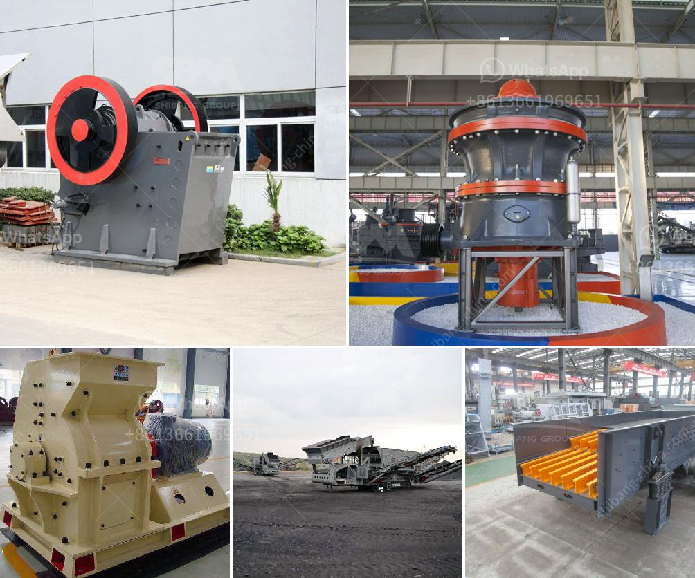

<h3>jaw crusher comparison advantages</h3>
Jaw crushers are renowned around the world for their effectiveness and efficiency in crushing hard and abrasive materials. However, choosing the right jaw crusher for your needs can be a challenging task. With so many options available, it's essential to compare the different models and their advantages to make an informed decision.

When it comes to jaw crushers, there are primarily two types: single toggle and double toggle crushers. Single toggle crushers have fewer moving parts, making them simpler and less costly to maintain than double toggle crushers. This makes them an excellent choice for small to medium-sized operations with lower production requirements.

On the other hand, double toggle crushers are designed to handle larger feed sizes and higher productivity levels. They typically have a higher throughput, allowing them to process more material in less time. Additionally, double toggle crushers provide a more aggressive crushing action, reducing the size of even the hardest materials effectively.

Another advantage of jaw crushers is their versatility. They are suitable for a wide range of applications, including quarrying, mining, and recycling. Whether you need to crush concrete, rock, or any other material, a jaw crusher can handle it with ease. This makes them ideal for diverse industries and ensures a higher return on investment.

In terms of maintenance, jaw crushers are relatively easy to take care of. Regular lubrication and check-ups of key components can prolong the lifespan of the crusher and improve its performance. Additionally, most jaw crushers are equipped with a hydraulic system that simplifies the jaw adjustment process, making it hassle-free for operators.

In conclusion, jaw crushers offer numerous advantages that make them the preferred choice for crushing operations worldwide. The range of models available ensures that there is a jaw crusher suitable for every application and production requirement. Whether you need a smaller, simpler crusher or a high-throughput crusher for demanding operations, jaw crushers have got you covered. So, carefully considering the advantages and comparing different models will enable you to select the ideal jaw crusher for your business.
<h3>Contact us</h3><ul><li><strong>Whatsapp:&nbsp;<a href="https://wa.me/8613661969651">+8613661969651</a></strong></li><li><a href="https://swt.shibang-china.com/?git&amp;zhl&amp;jaw crusher comparison advantages"><strong>Online Service(chat now)</strong></a></li></ul><h3>Related</h3><ul><li><a href='impact crusher plant for sale.md'>impact crusher plant for sale</a></li><li><a href='hydraulic jaw crusher 30 x 40.md'>hydraulic jaw crusher 30 x 40</a></li><li><a href='process of coal crushing plant.md'>process of coal crushing plant</a></li><li><a href='stone crush machine price in pakistan.md'>stone crush machine price in pakistan</a></li><li><a href='tons per hour mobile crushers.md'>tons per hour mobile crushers</a></li></ul>