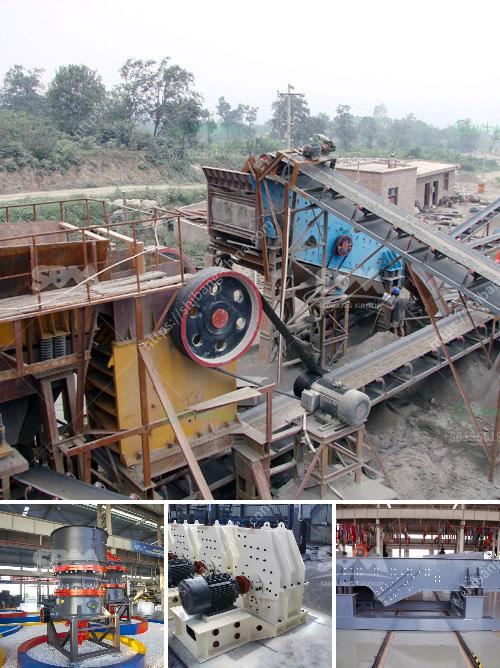

<h3>jaw crusher engine and complete set</h3>
A jaw crusher is one of the most commonly used crushing machines in the mining industry. This powerful device is often utilized in construction projects and the mining industry thanks to its ability to crush tough and abrasive materials. The jaw crusher engine and complete set are essential components for efficient and reliable performance.

The engine is the heart of the jaw crusher, providing power to move the machine and crush the materials. It typically operates on diesel fuel, which makes it suitable for use in remote areas with limited access to electricity. The engine usually relies on a series of belts or gears to transfer the power generated to the crusher's working components.

When the engine provides power, it drives the flywheel mounted on one end of the eccentric shaft. The flywheel not only helps to store energy but also provides the necessary momentum to the crushing jaws. As the material enters the crushing chamber, the eccentric shaft spins, creating a compressive force that breaks the material into smaller pieces. This process is repeated continuously until the desired size is achieved.

The complete set of a jaw crusher consists of several key components working together to ensure excellent performance and productivity. These components include the crusher body, the crushing jaws, the toggle plate, and the discharge opening.

The crusher body houses the engine and other vital parts, providing structural support while minimizing vibrations. It is typically made of heavy-duty steel or cast iron, capable of withstanding high-stress loads.

The crushing jaws are the main working components responsible for reducing the size of the material. These robust jaws exert a high crushing force when they come together, efficiently breaking even the toughest rocks and ores. They are often made from manganese steel or other durable materials resistant to wear and abrasion.

The toggle plate is a small but crucial part that connects the swinging jaw to the rest of the crusher's structure. It helps in distributing the crushing force evenly, preventing the crushing jaws from wearing prematurely.

Lastly, the discharge opening plays a critical role in controlling the size of the crushed material. By adjusting the gap between the jaws, operators can vary the final size of the product and meet specific requirements.

Choosing the right jaw crusher engine and complete set is crucial to ensure optimal performance and productivity. Factors such as the feed size, desired output, and material characteristics should be considered when selecting the appropriate engine power and crusher size.

In conclusion, the jaw crusher engine and complete set are essential components for efficient and reliable crushing operations. With their robust construction and powerful performance, they can handle even the toughest materials. Whether used in the mining industry or construction projects, a jaw crusher offers a reliable solution for breaking down rocks and ores.
<h3>Contact us</h3><ul><li><strong>Whatsapp:&nbsp;<a href="https://wa.me/8613661969651">+8613661969651</a></strong></li><li><a href="https://swt.shibang-china.com/?git&amp;zhl&amp;jaw crusher engine and complete set"><strong>Online Service(chat now)</strong></a></li></ul><h3>Related</h3><ul><li><a href='silica sand manufacturing plant.md'>silica sand manufacturing plant</a></li><li><a href='india edible clay making process.md'>india edible clay making process</a></li><li><a href='sand screening machine philippines.md'>sand screening machine philippines</a></li><li><a href='price of ballast crusher per ton in kenya.md'>price of ballast crusher per ton in kenya</a></li><li><a href='crusher peru price crushing plant.md'>crusher peru price crushing plant</a></li></ul>