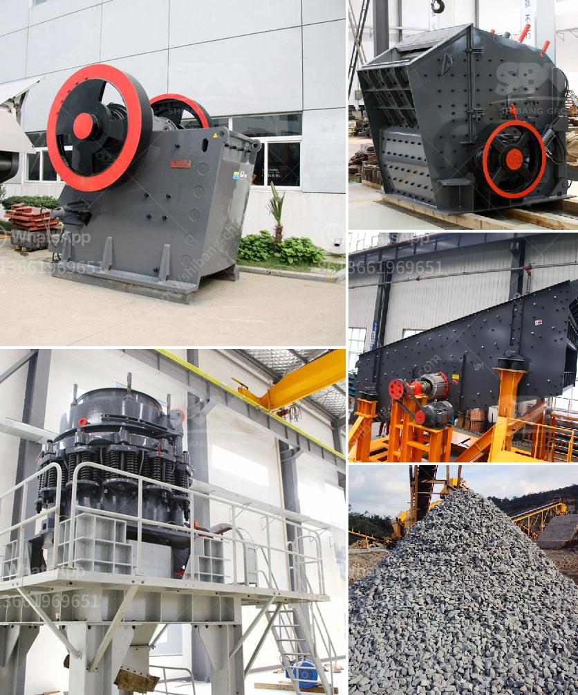

<h3>jaw crusher for 220x160</h3>
The jaw crusher is a vital tool in the mining industry as it helps to break down large rocks into smaller, more manageable pieces. These pieces can then be used for various purposes such as construction materials and road building.

The jaw crusher is specifically designed to handle hard and abrasive materials, ensuring efficiency and long-lasting performance. It is equipped with a sturdy and durable jaw plate, which increases overall crushing capacity and offers reliability even in the toughest conditions.

The 220x160 size of the jaw crusher makes it ideal for heavy-duty applications. Its compact design allows for easy transportation and installation in various mining sites. Despite its smaller size, this jaw crusher boasts a maximum crushing capacity of 100-300 tons per hour.

One of the key features of the jaw crusher is its adjustable setting, which allows for precise and uniform particle size output. This ensures consistent product quality and reduces the need for secondary crushing or screening processes.

Furthermore, the jaw crusher operates at a low noise level, making it suitable for use in urban areas where noise pollution regulations are strict. Its efficient design and low energy consumption also contribute to reducing carbon emissions and overall environmental impact.

In conclusion, the jaw crusher for 220x160 is a highly efficient and reliable tool for the mining industry. Its compact size, high crushing capacity, and adjustable setting make it suitable for a wide range of applications. Whether it is aggregate production or recycling, this jaw crusher delivers exceptional performance and helps to streamline mining operations.
<h3>Contact us</h3><ul><li><strong>Whatsapp:&nbsp;<a href="https://wa.me/8613661969651">+8613661969651</a></strong></li><li><a href="https://swt.shibang-china.com/?git&amp;zhl&amp;jaw crusher for 220x160"><strong>Online Service(chat now)</strong></a></li></ul><h3>Related</h3><ul><li><a href='grinding roller mill.md'>grinding roller mill</a></li><li><a href='mobile crushing alocation.md'>mobile crushing alocation</a></li><li><a href='mobile crusher plant for sale.md'>mobile crusher plant for sale</a></li><li><a href='manganese ore wash plant.md'>manganese ore wash plant</a></li><li><a href='vertical grinder for spindle.md'>vertical grinder for spindle</a></li></ul>