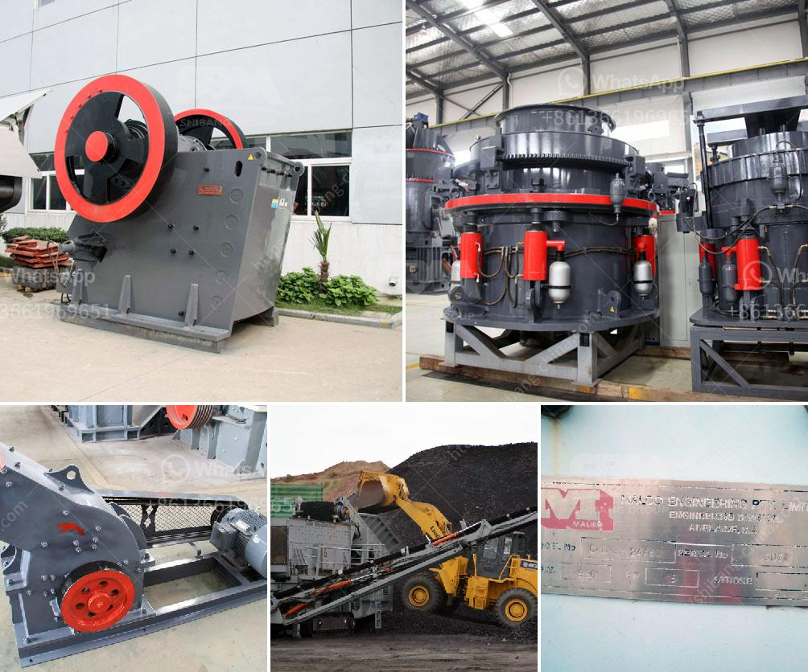

<h3>jaw crusher for sale in china</h3>
The jaw crusher, often called the "Tiger Mouth," is a durable and highly efficient crushing machine used by construction, mining, and aggregate industries worldwide. It is specifically designed to crush a variety of hard materials, such as rocks, ores, and minerals, making it well-suited for various primary and secondary crushing applications.

In China, jaw crushers are known for their sturdy construction, high reliability, and above all, their ability to process hard materials. With 10,000+ jaw crushers sold in China alone, the jaw crusher market is highly competitive and crowded. However, the available jaw crushers in the market require enormous investments and are only capable of processing larger-sized rocks. 

Thankfully, a new type of jaw crusher has recently hit the market that is perfect for smaller-sized rocks. This jaw crusher created by China Hongxing Machinery is also known as the mini jaw crusher. With its small footprint and lightweight design, this machine is very easy to transport and use on-site. It requires minimal manual intervention for operation and maintenance, making it the perfect solution for smaller mining companies and contractors.

The mini jaw crusher for sale is suitable for crushing materials with compressive strength not higher than 320 MPa. The maximum size of materials that can be crushed is 85mm. The mini crusher is equipped with a flawless design that ensures durability and longevity. The machine is easily customizable, allowing for different models to be created to optimize performance in any environment. They are also equipped with dustproof protection devices, which eliminate the dust pollution generated during the work process.

Moreover, the mini jaw crusher is powered by a motor and equipped with a lubrication system, ensuring smooth operation. Its optimized design allows for easy maintenance and disassembly, reducing downtime. Additionally, it has a low noise level, making it an excellent choice for both working environments and residential areas.

In conclusion, the mini jaw crusher for sale in China is an excellent choice for small-scale construction and aggregate production. For its rugged construction, superior performance, and low maintenance requirements, it is undoubtedly the best choice for small mining projects.
<h3>Contact us</h3><ul><li><strong>Whatsapp:&nbsp;<a href="https://wa.me/8613661969651">+8613661969651</a></strong></li><li><a href="https://swt.shibang-china.com/?git&amp;zhl&amp;jaw crusher for sale in china"><strong>Online Service(chat now)</strong></a></li></ul><h3>Related</h3><ul><li><a href='gypsum production machinery.md'>gypsum production machinery</a></li><li><a href='cement grinding mills.md'>cement grinding mills</a></li><li><a href='chinese crusher plants.md'>chinese crusher plants</a></li><li><a href='rotary kiln cement plant cost in india.md'>rotary kiln cement plant cost in india</a></li><li><a href='quarry crusher philippines.md'>quarry crusher philippines</a></li></ul>