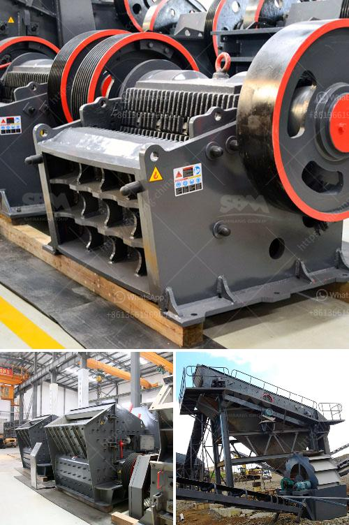

<h3>jaw crusher for sale uk</h3>
When it comes to crushing machinery, the jaw crusher is arguably one of the most sought-after pieces of equipment in the UK. With numerous applications in construction, mining, demolition, and recycling, jaw crushers offer efficient and reliable performance. If you're in the market for a jaw crusher, there are several important factors to consider. This article will provide a brief overview of jaw crusher for sale UK.

Jaw crushers are designed to break down large rocks into smaller, more manageable particles. They consist of a fixed jaw plate and a movable jaw plate. The two jaws create a V-shaped cavity where the rocks are initially pressed and then crushed as the movable jaw moves inward against the fixed jaw. This process enables efficient reduction of material size.

One of the key advantages of jaw crushers is their versatility. They can handle a wide range of materials, including hard and abrasive ones. This makes them ideal for various industries, such as construction, where different types of rocks and aggregates need to be processed.

When searching for a jaw crusher for sale in the UK, it is important to consider factors such as the crusher's capacity, power consumption, and reliability. The size and hardness of the incoming material should also be taken into account to ensure that the chosen jaw crusher is suitable for the specific application.

Furthermore, it is essential to purchase the equipment from a reputable seller to guarantee quality and excellent customer service. Reputable suppliers typically offer warranties, spare parts availability, and after-sales support, ensuring that any issues or concerns can be addressed promptly.

In conclusion, a jaw crusher is an essential piece of equipment for various industries. Its versatility, efficiency, and reliability make it a desirable investment for businesses in the UK. When considering a jaw crusher for sale, it is important to take into account factors such as capacity, power consumption, and reliability, while also choosing a reputable supplier to ensure a positive purchasing experience.
<h3>Contact us</h3><ul><li><strong>Whatsapp:&nbsp;<a href="https://wa.me/8613661969651">+8613661969651</a></strong></li><li><a href="https://swt.shibang-china.com/?git&amp;zhl&amp;jaw crusher for sale uk"><strong>Online Service(chat now)</strong></a></li></ul><h3>Related</h3><ul><li><a href='ball mill in mumbai.md'>ball mill in mumbai</a></li><li><a href='crusher mill sales in malaysia.md'>crusher mill sales in malaysia</a></li><li><a href='fly ash processing plant for sale.md'>fly ash processing plant for sale</a></li><li><a href='impact crusher discount.md'>impact crusher discount</a></li><li><a href='sand washing screener florida.md'>sand washing screener florida</a></li></ul>