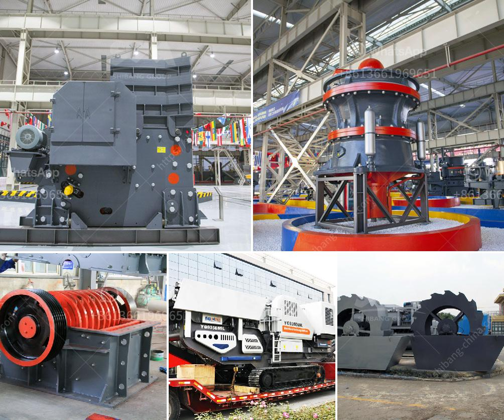

<h3>jaw crusher in uae</h3>
A jaw crusher is a machine designed to break large rocks into smaller rocks, gravel, or sand. It utilizes a compressive force to crush materials between two jaws. As one of the most commonly used crushers in the United Arab Emirates (UAE), the jaw crusher is widely used in the mining and construction industry.

Due to its versatility, the jaw crusher has become a crucial piece of equipment in the construction, mining, and quarrying industry in the UAE. Jaw crushers are commonly used in quarries for breaking down oversized rocks that cannot be handled by other rock breakers. They are also used for primary crushing of aggregate on construction sites, processing various minerals and ores, and recycling demolition waste.

One of the key benefits of a jaw crusher is its ability to handle a wide range of feed materials, as well as produce a consistent and high-quality end product. This makes it ideal for use in the UAE, where high-quality materials are essential for infrastructure projects.

Another advantage of jaw crushers is their simplicity of design and operation. With a straightforward mechanical structure, jaw crushers are easy to maintain, ensuring reduced downtime and increased productivity. The cost-effectiveness of jaw crushers further adds to their appeal in the UAE.

Furthermore, jaw crushers offer the added benefit of reducing the environmental impact associated with the extraction and processing of materials. By reducing the need for blasting and reducing overall energy consumption, jaw crushers contribute to sustainable quarrying practices in the UAE.

In conclusion, the jaw crusher has been a staple in the UAE's mining and construction industry for many years. By utilizing a compressive force, the jaw crusher efficiently breaks down large rocks into smaller, more manageable sizes, making it a crucial piece of equipment in the UAE's construction and quarrying industry. Its versatility, simplicity, and cost-effectiveness make it an excellent choice for various applications, while also supporting sustainable quarrying practices.
<h3>Contact us</h3><ul><li><strong>Whatsapp:&nbsp;<a href="https://wa.me/8613661969651">+8613661969651</a></strong></li><li><a href="https://swt.shibang-china.com/?git&amp;zhl&amp;jaw crusher in uae"><strong>Online Service(chat now)</strong></a></li></ul><h3>Related</h3><ul><li><a href='the price of stone crusher.md'>the price of stone crusher</a></li><li><a href='stone crusher in the philippines for sale.md'>stone crusher in the philippines for sale</a></li><li><a href='coal pulverizer machine price.md'>coal pulverizer machine price</a></li><li><a href='sample business plan for crushed stone.md'>sample business plan for crushed stone</a></li><li><a href='gypsum ball mill manufacturing machine.md'>gypsum ball mill manufacturing machine</a></li></ul>