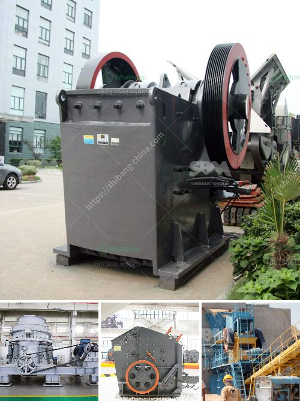

<h3>jaw crusher machine</h3>
A jaw crusher machine uses compressive force for breaking of various types of raw materials into smaller pieces. It has wide application in mining, construction, metallurgy, highway, railway, water conservancy, and chemical industries. Jaw crusher machine consists of a stationary jaw plate and a moving jaw plate. When the two jaw plates are close to each other, the materials can be crushed. When the two jaw plates leave, the crushed materials will be discharged from the outlet.

One of the primary advantages of jaw crusher machine is the high reduction ratio. This reduces the size of the raw materials for further processing, making it easier to prepare for subsequent equipment. Additionally, the high reduction ratio also allows the jaw crusher machine to be more efficient while consuming less energy.

Another advantage of this machine is its versatility. Jaw crusher machines can crush various types of materials, including limestone, granite, concrete, iron ore, and others. This makes it suitable for many industries and applications, from quarrying and mining to recycling and construction.

Furthermore, the jaw crusher machine is simple in design, easy to operate, and low maintenance. Its robust construction ensures durability and long service life. The machine is also equipped with safety devices to ensure operator's safety during operation.

In conclusion, the jaw crusher machine is a highly versatile and efficient tool for crushing different types of raw materials. It offers great advantages in terms of reduction ratio, versatility, ease of operation, and low maintenance. Whether you are in the mining, construction, or recycling industry, a jaw crusher machine can greatly enhance your operations and productivity.
<h3>Contact us</h3><ul><li><strong>Whatsapp:&nbsp;<a href="https://wa.me/8613661969651">+8613661969651</a></strong></li><li><a href="https://swt.shibang-china.com/?git&amp;zhl&amp;jaw crusher machine"><strong>Online Service(chat now)</strong></a></li></ul><h3>Related</h3><ul><li><a href='jaw crusher engine and complete set.md'>jaw crusher engine and complete set</a></li><li><a href='used rock crushing plant for sale in uae.md'>used rock crushing plant for sale in uae</a></li><li><a href='rock crusher machines.md'>rock crusher machines</a></li><li><a href='accessories for chia conveyor belts.md'>accessories for chia conveyor belts</a></li><li><a href='industrial grinder in algeria.md'>industrial grinder in algeria</a></li></ul>