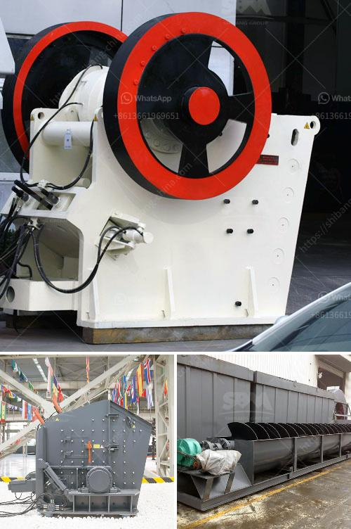

<h3>jaw crusher new design</h3>
The jaw crusher has undergone a revolutionary transformation in terms of design. The innovative new jaw crusher design incorporates a double-toggle mechanism that ensures the crusher setting is automatically adjusted to help effectively reduce the material size, achieve a higher throughput capacity, and deliver a more consistent product size.

The new design optimizes the movement of the swing jaw and toggles, resulting in a jaw crusher that not only delivers increased efficiency but also expands its operational capabilities. With its wider opening and larger motor, this jaw crusher provides an impressive increase in capacity, resulting in higher production rates, making it an ideal choice for contractors and quarry operators.

The jaw crusher's new design eliminates the need for manual adjustments. This innovative feature automatically adjusts the crusher settings to ensure an even and consistent material size distribution is maintained. By continuously monitoring the load on the crusher, it automatically adapts to variations in the feed material and adjusts the crusher's parameters for optimal performance. As a result, the jaw crusher operates at peak efficiency, reducing downtime, and increasing production rates.

In addition to its enhanced performance and automatic adjustments, the new design also prioritizes durability and ease of maintenance. The jaw crusher's robust construction ensures a long lifespan and reliable operation. The swing jaw assembly and the bearing seating frame are all made of high-quality cast steel, which provides exceptional strength and stability under heavy operating conditions. This allows the crusher to endure high shock loads and frequent impact forces, resulting in reduced maintenance needs and increased uptime.

Furthermore, this new design features simplified maintenance procedures. The improved accessibility to key components allows for quicker and easier inspections, replacements, or repairs. This reduces overall downtime and enhances the efficiency of maintenance operations, ensuring that the crusher is constantly operating at its best.

The redesigned jaw crusher also incorporates advanced safety features to protect operators and maintenance personnel. The integrated hydraulic system automatically releases the crusher's pressure, preventing any potential damage caused by oversize material or uncrushable objects. Additionally, the jaw crusher is equipped with an emergency stop button, which instantly halts the operation in case of any unforeseen issues, ensuring the safety of all personnel involved.

The new design of the jaw crusher breaks conventional boundaries, improving its efficiency, capacity, and versatility. With automatic adjustments ensuring consistent product size, enhanced durability and easier maintenance, this updated jaw crusher is undoubtedly a valuable asset for various industries. Not only does it provide higher productivity and reduced downtime, but it also guarantees the safety and well-being of operators.

As the demand for efficient crushing equipment continues to rise, the innovative design of this jaw crusher sets a new industry standard. It promises to reshape the future of jaw crushers by delivering enhanced performance, increased productivity, and improved operational efficiency.
<h3>Contact us</h3><ul><li><strong>Whatsapp:&nbsp;<a href="https://wa.me/8613661969651">+8613661969651</a></strong></li><li><a href="https://swt.shibang-china.com/?git&amp;zhl&amp;jaw crusher new design"><strong>Online Service(chat now)</strong></a></li></ul><h3>Related</h3><ul><li><a href='manufacturing of gypsum board production lines.md'>manufacturing of gypsum board production lines</a></li><li><a href='stone crushers plant prices.md'>stone crushers plant prices</a></li><li><a href='vertical horizontal milling machine.md'>vertical horizontal milling machine</a></li><li><a href='limestone crushing plant in india price.md'>limestone crushing plant in india price</a></li><li><a href='sell plant of crushing mobile.md'>sell plant of crushing mobile</a></li></ul>