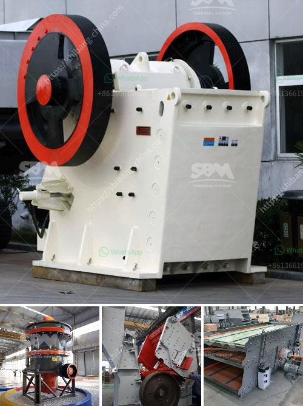

<h3>jaw crusher pe 150x250</h3>
The jaw crusher PE 150x250 is a small but sturdy machine that can crush all kinds of hard rocks and other materials. It is powered by a diesel engine and has a feed opening of 150x250 mm.This crusher can be used for crushing various ore and rock materials, such as granite, marble, basalt, limestone, river gravel, etc.

One of the key features of this small jaw crusher is its high efficiency. It can crush materials into uniform size particles with a high reduction ratio, which means that the final product will have fewer fines and more uniform shape. This makes it ideal for construction projects and other applications where uniformity of the crushed material is important.

Another advantage of the PE 150x250 jaw crusher is its simplicity in design and operation. The machine has few moving parts, which means that it is easy to maintain and repair. Additionally, the simple design also makes it less prone to breakdowns, further increasing its reliability and durability.

The PE 150x250 jaw crusher is also versatile in its applications. It can be used for crushing rocks and ores with different hardness levels, from soft to hard. This makes it suitable for a wide range of industries, including mining, quarrying, construction, and recycling. Whether you need to crush hard stones or recycle concrete waste, this crusher can handle the job efficiently.

Moreover, the PE 150x250 jaw crusher is compact in size and lightweight, making it easy to transport and move around. This is especially beneficial for temporary projects or for contractors who need to move their equipment frequently. The compact design also means that it requires less space to operate, allowing it to be used in tight spaces or confined areas.

When it comes to price, the PE 150x250 jaw crusher offers excellent value for money. It is an affordable option for small-scale operators or those with a limited budget. Despite its compact size and affordable price, this crusher delivers excellent results and can compete with larger and more expensive machines.

In conclusion, the jaw crusher PE 150x250 is a small but powerful machine that offers high efficiency, versatility, and reliability. It is an excellent choice for small to medium-sized projects and provides a cost-effective solution for crushing various materials. Whether you need to crush rocks or recycle construction waste, this jaw crusher can handle the task effectively. With its simple design, ease of maintenance, and affordable price, it is a valuable addition to any crushing operation.
<h3>Contact us</h3><ul><li><strong>Whatsapp:&nbsp;<a href="https://wa.me/8613661969651">+8613661969651</a></strong></li><li><a href="https://swt.shibang-china.com/?git&amp;zhl&amp;jaw crusher pe 150x250"><strong>Online Service(chat now)</strong></a></li></ul><h3>Related</h3><ul><li><a href='all about ball mills.md'>all about ball mills</a></li><li><a href='grinding mill grinding machine grinders grinning mill.md'>grinding mill grinding machine grinders grinning mill</a></li><li><a href='kenya quarry crusher.md'>kenya quarry crusher</a></li><li><a href='copper processing plants in usa for sale.md'>copper processing plants in usa for sale</a></li><li><a href='stone crushing production process.md'>stone crushing production process</a></li></ul>