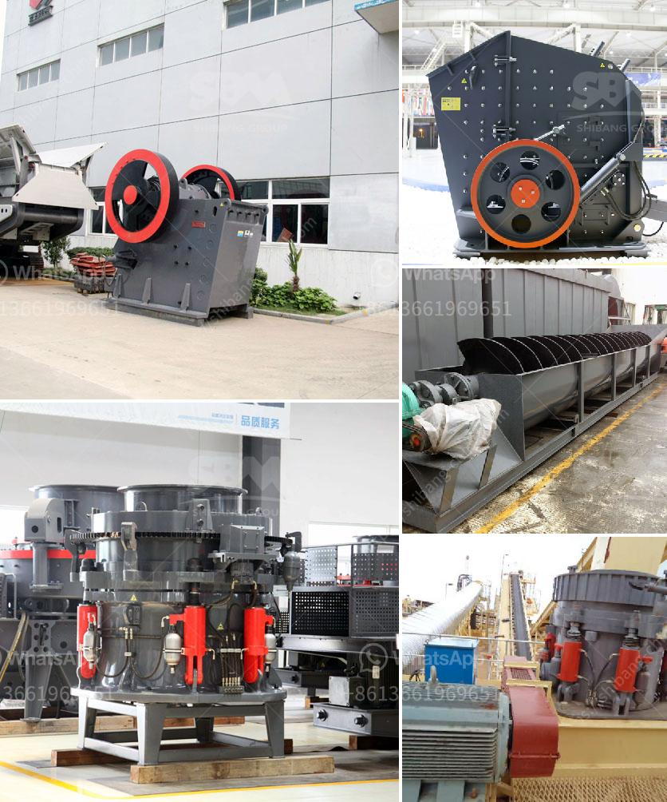

<h3>jaw crusher pe 500 x 750 price</h3>
Jaw crusher PE 500 x 750 is one of the most popular models in the market. As the infrastructure construction and mining industry is booming in recent years, more and more customers are willing to invest in this type of crusher. PE 500 x 750 jaw crusher is designed with deep crushing cavity, longer service life and high crushing efficiency. The jaw crusher discharging size can be adjusted from 50mm to 100mm, which is flexible and convenient.

PE 500 x 750 jaw crusher price is often used for aggregate production requirements and ore processing requirements. Many customers are very concerned about the price of stone crusher. Now I will introduce you to the specific price of this model jaw crusher.

As we all know, jaw crusher is an expensive mechanical equipment. Therefore, we must choose a reasonable price when purchasing. Under the premise of ensuring quality, the price of the equipment can be seen as an important factor. The price of this model jaw crusher is affected by many factors. Below are some of the factors that influence its price:

1. Production cost: The production cost of jaw crusher is the sum of the cost of raw materials, labor costs and manufacturing expenses. Different manufacturers may have different production costs, leading to different prices of the equipment.

2. Market demand: Since the jaw crusher is a popular model, the market demand for it is relatively large. When the market demand is high, the price of the equipment may be higher. On the contrary, when the market demand is low, the price of the equipment may be lower.

3. Competition among manufacturers: There are many manufacturers producing jaw crushers in the market. Manufacturers will set different prices based on their own understanding of the market and their own production and operation costs. In order to gain a competitive advantage, some manufacturers may lower the price of equipment, leading to a lower price for the equipment.

4. Configuration of the equipment: Jaw crusher can be equipped with different types of accessories, such as supporting motor, vibrating feeder, conveyor belt, etc. The configuration of these accessories will affect the price of the equipment. The more complete the configuration, the higher the price.

In summary, the price of jaw crusher PE 500 x 750 is influenced by many factors. Therefore, in the process of purchasing equipment, customers must choose a reliable manufacturer and conduct a comprehensive analysis of the factors affecting the price in order to select a cost-effective equipment.

In addition to the price, it is also important to consider the quality of the equipment and after-sales service. A good jaw crusher should have reliable performance, low failure rate, and long service life. And the manufacturer should provide comprehensive after-sales service, including equipment installation, commissioning, training, and regular maintenance.

Purchasing a jaw crusher is a significant investment, so it is necessary to choose the right equipment and manufacturer to ensure long-term benefits. By understanding the price factors and considering the quality and after-sales service, customers can make a more informed decision and maximize their return on investment.
<h3>Contact us</h3><ul><li><strong>Whatsapp:&nbsp;<a href="https://wa.me/8613661969651">+8613661969651</a></strong></li><li><a href="https://swt.shibang-china.com/?git&amp;zhl&amp;jaw crusher pe 500 x 750 price"><strong>Online Service(chat now)</strong></a></li></ul><h3>Related</h3><ul><li><a href='vertical grinding process.md'>vertical grinding process</a></li><li><a href='companies selling mining equipment.md'>companies selling mining equipment</a></li><li><a href='brick factory for sale in uk.md'>brick factory for sale in uk</a></li><li><a href='ball mill south africa.md'>ball mill south africa</a></li><li><a href='calcium carbonate proses by process.md'>calcium carbonate proses by process</a></li></ul>