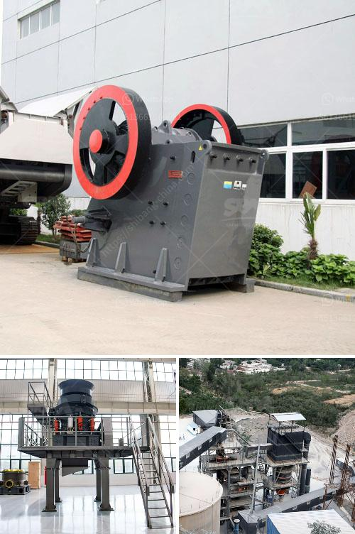

<h3>jaw crusher plant price</h3>
If you have a substantial amount of rocks or ores to crush, getting a jaw crusher plant is a good idea. However, what makes this equipment essential? Why should you consider investing in one? This article will explore the reasons for purchasing a jaw crusher plant, including its price range.

First and foremost, a jaw crusher plant is known for its exceptional crushing ability. It can break down even the hardest materials, such as granite or basalt. This is particularly beneficial in industries like mining, construction, or demolition, where large rocks or ores need to be transformed into smaller pieces for further processing.

The efficiency of a jaw crusher plant is another compelling factor to consider. These machines can process large quantities of material in a relatively short period. Therefore, they can significantly increase productivity and reduce labor costs, making them an excellent investment for businesses looking to streamline their operations.

Another advantage of a jaw crusher plant is its versatility. It can handle a wide range of materials, including sandstone, limestone, or concrete. This means that the equipment can be used in various industries, such as aggregate production, recycling, or road construction. With a single investment, you can cater to multiple needs and diversify your business.

Now, let's talk about price. The jaw crusher plant price can vary significantly depending on various factors. These include the production capacity, the size and hardness of the feed material, as well as the desired final product size. Additionally, the market conditions and the specific requirements of the customer can also influence the cost.

On average, a jaw crusher plant can cost between $30,000 and $500,000. The price largely depends on the size, production capacity, and configuration of the equipment. Typically, a 200-300 tph plant will have a cost closer to $150,000, while a 600-900 tph plant can cost around $250,000.

Remember, the price is just one aspect to consider when purchasing a jaw crusher plant. It's crucial to assess other factors like the quality, reliability, and service provided by the manufacturer. Doing thorough research and comparing multiple suppliers will help you find the best option that suits your needs and budget.

Furthermore, it's essential to consider the long-term benefits of investing in a high-quality jaw crusher plant. By opting for robust and durable equipment, you can minimize maintenance costs and prolong the lifespan of the machine. This will ultimately yield a higher return on investment.

In conclusion, a jaw crusher plant is a valuable asset for any business involved in crushing or processing rocks and ores. Its exceptional crushing ability, efficiency, and versatility make it an indispensable investment. While the price can vary depending on numerous factors, weighing these against the long-term benefits will help make an informed decision. So, if you're looking to enhance your productivity and streamline your operations, investing in a jaw crusher plant might be just what you need.
<h3>Contact us</h3><ul><li><strong>Whatsapp:&nbsp;<a href="https://wa.me/8613661969651">+8613661969651</a></strong></li><li><a href="https://swt.shibang-china.com/?git&amp;zhl&amp;jaw crusher plant price"><strong>Online Service(chat now)</strong></a></li></ul><h3>Related</h3><ul><li><a href='stone crush machine price in pakistan.md'>stone crush machine price in pakistan</a></li><li><a href='feasibility study on barite milling plants.md'>feasibility study on barite milling plants</a></li><li><a href='stone crusher cameroon.md'>stone crusher cameroon</a></li><li><a href='crusher machine to make fine powder.md'>crusher machine to make fine powder</a></li><li><a href='impact crusher 70 130tph.md'>impact crusher 70 130tph</a></li></ul>