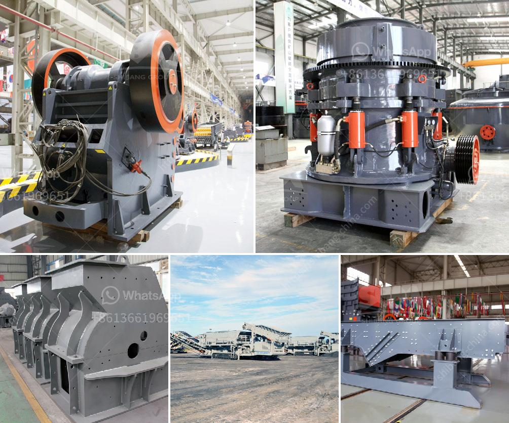

<h3>jaw crusher powder malaysia</h3>
In the mining and construction industry, the jaw crusher is arguably one of the most important pieces of equipment. It serves as a primary crusher for sorting materials such as rock, gravel, and minerals into sizes ranging from 3 inches to smaller sizes down to powder-like substances. With its powerful crushing capabilities, the jaw crusher has become a staple in various industries, including mining, construction, and demolition, among others.

Malaysia, a Southeast Asian country known for its vibrant economy, is no stranger to the importance of the jaw crusher powder malaysia. The country's diverse landscape presents a multitude of mineral resources, including tin, bauxite, iron ore, and limestone. These resources are crucial for the development of various industries, making the jaw crusher powder malaysia a crucial tool in extracting and processing these materials.

The jaw crusher powder malaysia features a fixed jaw and a moving jaw that together provide a powerful crushing action. The material in the feed is crushed between the jaws, breaking it into smaller pieces. This process continues until the material is small enough to pass through the narrow opening at the bottom of the crusher, resulting in the desired product size.

One of the key advantages of the jaw crusher powder malaysia is its versatility. It can handle a wide range of materials, from soft to hard rocks, making it suitable for various applications. For instance, in the mining industry, the jaw crusher is used for primary crushing of ores and minerals before they are further processed in other machines or equipment.

Similarly, in the construction industry, the jaw crusher powder malaysia plays a vital role in breaking down large pieces of concrete and asphalt into smaller, more manageable sizes. This allows for easy recycling and reuse of these materials, reducing waste and promoting sustainability.

The jaw crusher powder malaysia also offers various features and benefits that enhance its performance and safety. For instance, many models are equipped with a hydraulic system that ensures smooth and efficient operation, reducing downtime. Additionally, the jaw crusher is designed with safety measures to prevent accidents and protect the operator. This includes features such as a toggle plate, which acts as a safeguard in case of overloading or jamming.

When it comes to selecting the right jaw crusher powder malaysia for a specific application, several factors need to be considered. These include the hardness and abrasiveness of the material, desired product size, and production capacity requirements. Consulting with industry professionals and manufacturers can help ensure the right crusher is chosen for optimal performance.

In conclusion, the jaw crusher powder malaysia is a crucial piece of equipment in various industries, including mining and construction. Its powerful crushing capabilities make it an essential tool for extracting and processing a wide range of materials. The versatility, safety features, and performance of the jaw crusher make it a reliable choice for those looking to enhance their operations.
<h3>Contact us</h3><ul><li><strong>Whatsapp:&nbsp;<a href="https://wa.me/8613661969651">+8613661969651</a></strong></li><li><a href="https://swt.shibang-china.com/?git&amp;zhl&amp;jaw crusher powder malaysia"><strong>Online Service(chat now)</strong></a></li></ul><h3>Related</h3><ul><li><a href='stone crusher company in dubai.md'>stone crusher company in dubai</a></li><li><a href='equipment cost for silica sand mining.md'>equipment cost for silica sand mining</a></li><li><a href='concrete crushing machine for sale.md'>concrete crushing machine for sale</a></li><li><a href='bauxite processing plant.md'>bauxite processing plant</a></li><li><a href='impact crusher in lima peru.md'>impact crusher in lima peru</a></li></ul>