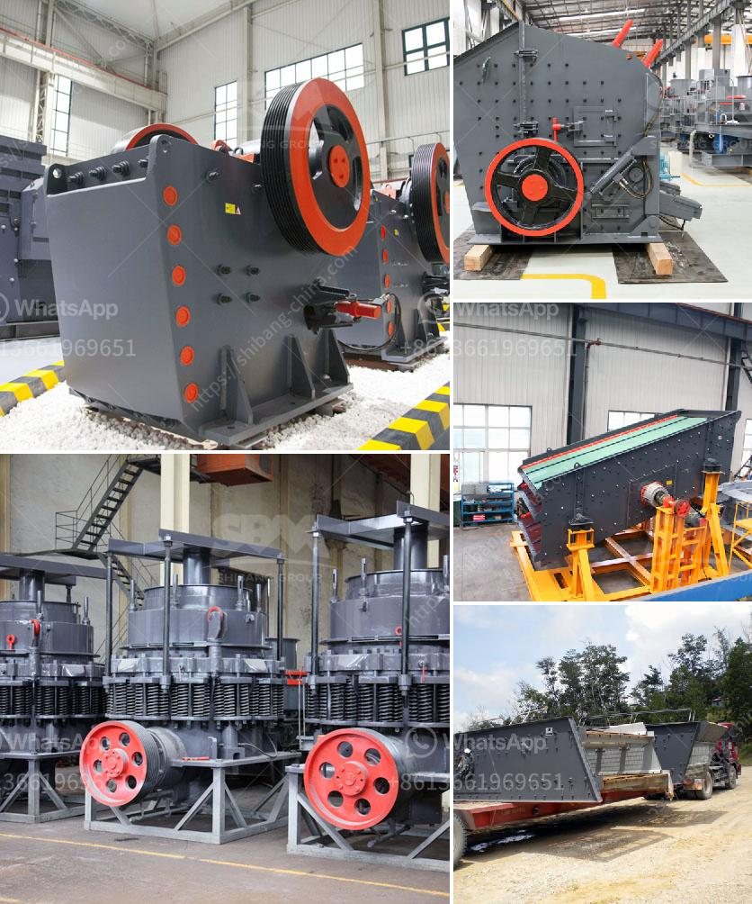

<h3>jaw crusher price in kenya</h3>
Jaw crusher, invented by Whitney Blake in 1858, is a primary stone crushing machine for reducing large rocks into smaller ones. Today, jaw crusher has become the very sophisticated coarse crushing machine and general crushing machine of rock and mineral material. Although in nearly 20 years, small and medium mines, particularly medium and small sized iron ore mines use jaw crusher for fine crushing, but the results were not as good as expected.

Engineered to perfection, this cost-effective and reliable jaw crusher has been used by major mining companies worldwide for over 30 years. The jaw crusher is equally suited in quarrying, demolition, recycling, and miningapplications. In closed circuit operations with a secondary crusher and screen, the jaw crusher allows to reduce stone from a 600mm raw feed down to precisely the right crushed product for your application.

Jaw crusher can be divided into large, medium and small sizes. The crusher with above 600MM feeding mouth is the large crusher, 300-600MM is medium crusher and less than 300MM is small jaw crusher. Jaw crusher can be classified into simple swing type jaw crusher (simple pendulum jaw crusher), complex swing type jaw crusher (complex pendulum jaw crusher) and integrated pendulum jaw crusher according to the different swinging ways of the movable jaw plate.

Since jaw crusher has different models, our company will choose the suitable crusher machine for you according to the actual requirements. If you are interested in the jaw crusher in Kenya, please contact our company directly. We will introduce the jaw crusher at competitive price for sale. +
<h3>Contact us</h3><ul><li><strong>Whatsapp:&nbsp;<a href="https://wa.me/8613661969651">+8613661969651</a></strong></li><li><a href="https://swt.shibang-china.com/?git&amp;zhl&amp;jaw crusher price in kenya"><strong>Online Service(chat now)</strong></a></li></ul><h3>Related</h3><ul><li><a href='cost of mini pulvrizers crusher.md'>cost of mini pulvrizers crusher</a></li><li><a href='hammer mill pc800 x 600.md'>hammer mill pc800 x 600</a></li><li><a href='industrial roller mill.md'>industrial roller mill</a></li><li><a href='how to made talcum powder.md'>how to made talcum powder</a></li><li><a href='complete gravel production line.md'>complete gravel production line</a></li></ul>