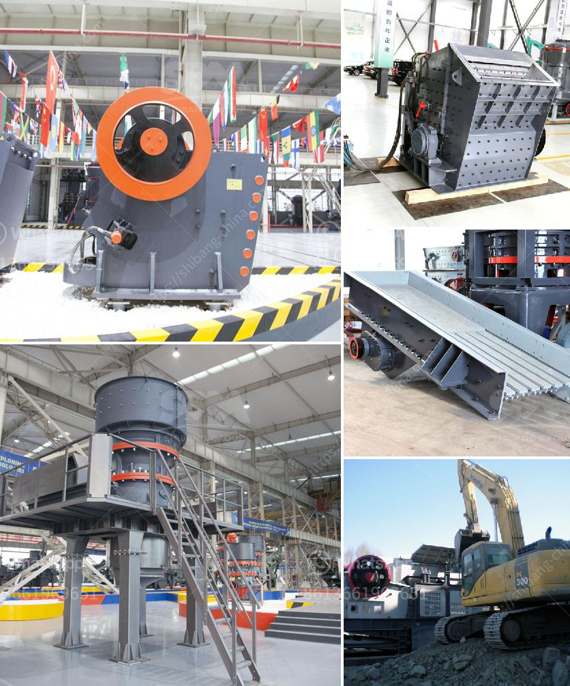

<h3>jaw crusher single toggle</h3>
Jaw crusher machines are widely used in the mining industry, where they are utilized for reducing the size of hard materials. These machines consist of a pair of vertically oriented jaw plates, one of which is fixed and the other is movable. The movable jaw compresses the material against the fixed jaw, crushing it to the desired size.

One of the most commonly used jaw crusher machines is the single toggle jaw crusher. This machine works by using a motor to drive the eccentric shaft, which causes the movable jaw plate to oscillate from side to side.

The single toggle design provides a more compact structure, which is ideal for smaller operations and tight spaces. It also allows for easier maintenance and lower operating costs, as there are fewer components involved.

The single toggle jaw crusher is known for its deep crushing chamber and aggressive angle of nip. This means that the jaw plates exert more pressure on the material being crushed compared to other jaw crushers. This additional pressure ensures that even the hardest materials can be processed effectively.

Additionally, the single toggle design allows for a higher throughput rate compared to double toggle jaw crushers. This means that the single toggle machines can efficiently process more material in less time, increasing overall productivity.

Another advantage of the single toggle jaw crusher is its ability to adjust the discharge setting. With a simple toggle plate adjustment, the machine can be set to achieve the desired product size. This flexibility is particularly beneficial when processing different types of materials or when a specific size of material is required.

In summary, the single toggle jaw crusher is an efficient machine that is widely used in the mining industry. Its compact design increases overall production capacity and enables more effective crushing of harder materials. It also offers flexibility in adjusting the discharge setting, making it suitable for a wide range of applications.
<h3>Contact us</h3><ul><li><strong>Whatsapp:&nbsp;<a href="https://wa.me/8613661969651">+8613661969651</a></strong></li><li><a href="https://swt.shibang-china.com/?git&amp;zhl&amp;jaw crusher single toggle"><strong>Online Service(chat now)</strong></a></li></ul><h3>Related</h3><ul><li><a href='gold milling plant cost.md'>gold milling plant cost</a></li><li><a href='rotary kiln cement plant cost in india.md'>rotary kiln cement plant cost in india</a></li><li><a href='processing of kaolin crusher.md'>processing of kaolin crusher</a></li><li><a href='rubble crushing machine.md'>rubble crushing machine</a></li><li><a href='portal gold mining machine.md'>portal gold mining machine</a></li></ul>