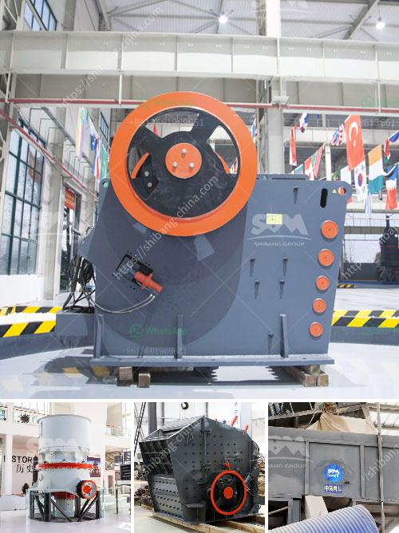

<h3>jaw crusher with production capacity of 80 100 ton hr</h3>
Nowadays, the demand for jaw crushers is continuously growing as the construction industry is booming around the world. The jaw crusher is designed to crush materials of any hardness, making it the perfect choice for primary crushing.

The newly developed technology and advanced equipment ensure that the jaw crusher can withstand the most arduous conditions. Its rugged construction allows it to operate in the harshest environments while maintaining optimum efficiency.

One particular jaw crusher that exemplifies this is the Nordberg® C80. With a production capacity of 80-100 tons per hour and a jaw opening of 800x510mm, this jaw crusher is ideal for various crushing operations. Its compact size, quick set-up times, ease of transport and user-friendly control system makes it a versatile choice for small to medium-sized contractors.

The Nordberg® C80 jaw crusher is powered by a 75 kW motor, ensuring smooth and efficient operation. Its unique toggle plate structure and optimized movement parameters provide excellent performance and reliable crushing capabilities. Its hydraulic jaw adjustment feature allows for quick and easy setting changes, ensuring the desired output size.

Additionally, the Nordberg® C80 jaw crusher is equipped with an integrated motor bed, reducing installation space and ensuring a compact and streamlined design. Its robust construction and high-quality components make it a durable option even in the most demanding applications.

The jaw crusher's reliable and consistent performance guarantees continuous production, maximizes uptime, and reduces maintenance costs. With its user-friendly features and versatility, the Nordberg® C80 jaw crusher is undoubtedly a game-changer in the crushing industry.

In conclusion, the jaw crusher with a production capacity of 80-100 ton/hr offers a reliable solution for quarrying, construction, and demolition waste recycling applications. This crushing plant is designed to crush up to 250 tons per hour, making it a superior choice for any job site. With its advanced technology and high capacity, the Nordberg® C80 jaw crusher provides excellent results and can be tailored to meet your specific needs.
<h3>Contact us</h3><ul><li><strong>Whatsapp:&nbsp;<a href="https://wa.me/8613661969651">+8613661969651</a></strong></li><li><a href="https://swt.shibang-china.com/?git&amp;zhl&amp;jaw crusher with production capacity of 80 100 ton hr"><strong>Online Service(chat now)</strong></a></li></ul><h3>Related</h3><ul><li><a href='used ball mills philippines.md'>used ball mills philippines</a></li><li><a href='components cone crusher and hydraulic system.md'>components cone crusher and hydraulic system</a></li><li><a href='semi industrial stone crusher.md'>semi industrial stone crusher</a></li><li><a href='cement manufacturing process pdf.md'>cement manufacturing process pdf</a></li><li><a href='gypsum crushing machines in pakistan.md'>gypsum crushing machines in pakistan</a></li></ul>