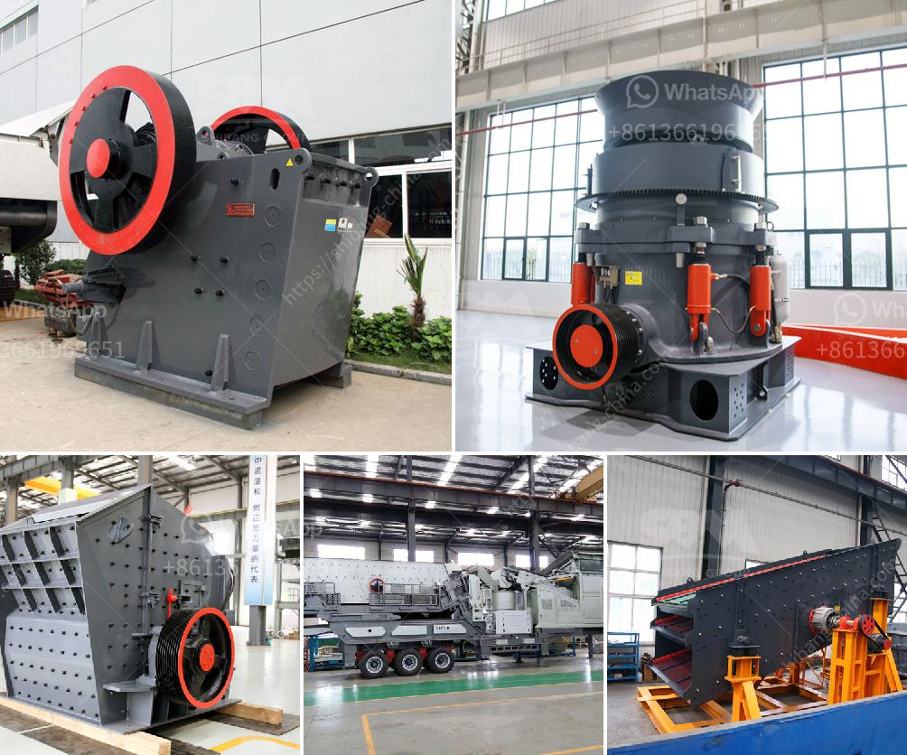

<h3>jaw crusher with protection</h3>
Jaw crushers are commonly used in the mining and construction industries to crush large stones and rocks into smaller pieces. These machines have a powerful crushing capacity that allows them to handle even the toughest materials. However, working with this type of equipment can be dangerous if proper precautions are not taken. This is where jaw crushers with protection come in.

Jaw crushers with protection are designed to prevent accidents and injuries that can be caused by the sudden release of material being crushed. They are equipped with safety features that minimize the risk of accidents and make the operation safer for the workers.

One of the main safety features of a jaw crusher with protection is the hydraulic release system. This system allows the crusher to automatically open in the event of a power failure or when the material being crushed becomes too hard or tough to pass through the machine. The hydraulic release system reduces the risk of damage to the crusher and prevents accidents caused by the sudden release of material.

Another safety feature of jaw crushers with protection is the overload protection device. This device automatically stops the crusher when an excessive load is detected. Overloading can cause the crusher to malfunction and lead to accidents and injuries. The overload protection device ensures that the crusher operates within its capacity limits, preventing damage and accidents.

Jaw crushers with protection also come with a safety toggle plate. This plate acts as a barrier and prevents the material being crushed from coming into direct contact with the moving parts of the crusher. It protects the workers from accidents and injuries that can be caused by flying debris.

Additionally, some jaw crushers with protection are equipped with a safety guard. This guard covers the crushing chamber and prevents workers from accidentally coming into contact with moving parts. It provides an extra layer of protection and minimizes the risk of accidents.

In conclusion, jaw crushers with protection offer a safer working environment for workers in the mining and construction industries. These machines are equipped with various safety features, such as the hydraulic release system, overload protection device, safety toggle plate, and safety guard. These features prevent accidents and injuries caused by the sudden release of material, overloading, and contact with moving parts. Investing in jaw crushers with protection is a crucial step towards ensuring the well-being of workers and maintaining a safe working environment.
<h3>Contact us</h3><ul><li><strong>Whatsapp:&nbsp;<a href="https://wa.me/8613661969651">+8613661969651</a></strong></li><li><a href="https://swt.shibang-china.com/?git&amp;zhl&amp;jaw crusher with protection"><strong>Online Service(chat now)</strong></a></li></ul><h3>Related</h3><ul><li><a href='coal machinery for coal processing crusher.md'>coal machinery for coal processing crusher</a></li><li><a href='grinding raymond mill for sale.md'>grinding raymond mill for sale</a></li><li><a href='concrete crushing machine for sale.md'>concrete crushing machine for sale</a></li><li><a href='stone crusher machine price in uganda.md'>stone crusher machine price in uganda</a></li><li><a href='calcite production plant.md'>calcite production plant</a></li></ul>