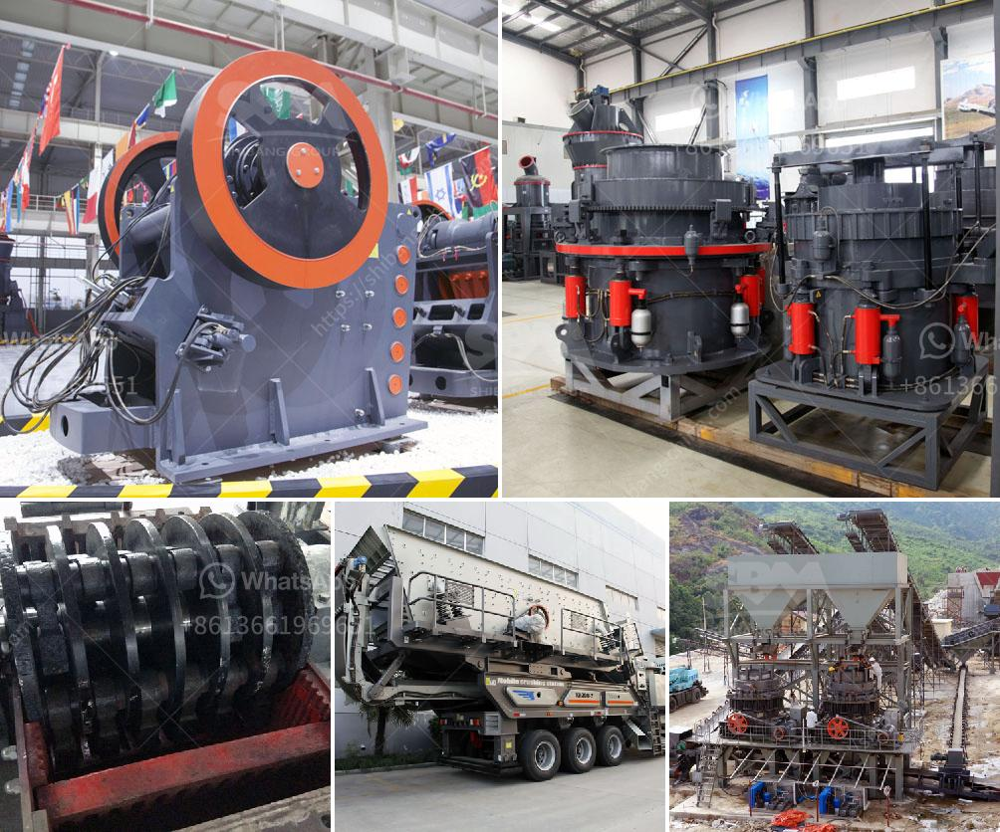

<h3>jaw crushers in south africa</h3>
Jaw crushers are used so extensively in South Africa that it is considered one of the most popular types of heavy machinery used for mining purposes. However, the less frequently used cone crusher in South Africa is still important in the industry, and is used in a wide range of applications throughout the country.

Jaw crushers are versatile machines and are commonly used in mining, metallurgical, construction, road building, and chemical industries. They function by crushing hard materials such as granite, quartz, or basalt between a stationary and a moving jaw. The "rockbuster" typically has a fixed feed area and a variable discharge area. Compression is essential when it comes to jaw crushers, as it is the means by which the stone or ore is reduced in size, requiring a large amount of force in order to effectively break it down.

The jaw crusher market is fairly competitive, due to the presence of several international and regional players. Some of the key manufacturers are Metso Corporation, Sandvik AB, and Thyssenkrupp AG. These companies focus on developing new products and expanding their market reach. They also invest in research and development activities to enhance their product line and improve their overall efficiency.

South Africa is rich in mineral resources, so it is a popular destination for many investors in the mining industry. However, there are challenges and obstacles facing the country's mining sector. One of the main challenges is the infrastructure, which is important for the efficient transportation of minerals from the mining sites to the processing plants. Jaw crushers play a crucial role in this process, as they help to provide the required aggregate for the infrastructure construction.

The demand for jaw crushers is growing at a steady pace due to increasing infrastructure development in the country, such as roads, railways, and power plants. In addition, the expansion of mining activities in the country is also expected to positively impact the growth of the jaw crusher market. The government has identified mining as a key sector for economic growth and has implemented several policies and reforms to attract foreign investment.

South Africa is also known for its advanced technology in the fields of mining and minerals. In fact, the country's mining industry has a worldwide reputation for being at the forefront of technological innovations. A jaw crusher is one of the primary machines that is used in the mining industry every day. In a quarry, mining operators need to break down large stones into smaller pieces which are then used further for various industrial applications.

Jaw crushers in South Africa have a long history of being used for crushing hard and abrasive rocks as a result of their simple and robust design. With the help of a jaw crusher, the rocks are crushed to smaller sizes and are ready for further processing. It is a crucial stage of the crushing process because the stones are reduced in size and are later ready for road construction or other infrastructure projects.

In conclusion, jaw crushers are extensively used in South Africa and are an important part of the mining infrastructure. They are beneficial due to their numerous features, such as convenient maintenance, low operation cost, and high crushing efficiency, resulting in a constant supply of aggregate for construction purposes across the country.
<h3>Contact us</h3><ul><li><strong>Whatsapp:&nbsp;<a href="https://wa.me/8613661969651">+8613661969651</a></strong></li><li><a href="https://swt.shibang-china.com/?git&amp;zhl&amp;jaw crushers in south africa"><strong>Online Service(chat now)</strong></a></li></ul><h3>Related</h3><ul><li><a href='gold crusher for sale in china.md'>gold crusher for sale in china</a></li><li><a href='calcite grinding machine manufacturer in udaipur.md'>calcite grinding machine manufacturer in udaipur</a></li><li><a href='single stage hammer crusher hot sale.md'>single stage hammer crusher hot sale</a></li><li><a href='buy ultra fine grinder mill.md'>buy ultra fine grinder mill</a></li><li><a href='stone crushers in kenya.md'>stone crushers in kenya</a></li></ul>