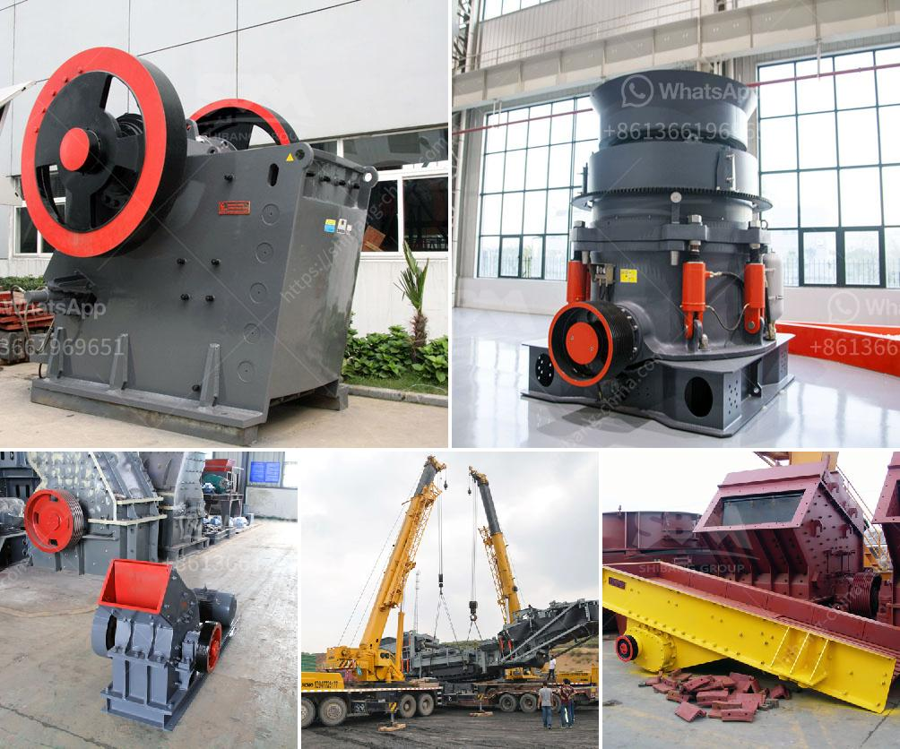

<h3>jaw crushers manufacturers</h3>
Jaw crushers are integral pieces of equipment in the mining and construction industries. They are used to crush stones and rock into smaller pieces, making it easier to transport and further process. With the rise in demand for aggregates, jaw crushers have seen a significant increase in popularity over the years. As a result, numerous manufacturers have emerged in the market, each offering unique jaw crusher models and specifications.

One of the leading jaw crusher manufacturers is [Manufacturer Name]. They have been manufacturing crushers for over [number of years] and have gained a reputation for producing reliable and efficient machines. Their jaw crushers are designed to handle a wide range of materials and applications, including hard and abrasive stones, gravel, and recycled concrete.

[Manufacturer Name]'s jaw crushers are known for their advanced features and innovative designs. They are equipped with a heavy-duty, high-capacity jaw crushing unit that delivers high production rates and excellent reduction ratios. The crushers also feature a user-friendly control panel, allowing operators to easily adjust settings and monitor performance.

In addition to [Manufacturer Name], there are several other notable jaw crusher manufacturers in the market. Some of these include [Manufacturer Name], [Manufacturer Name], and [Manufacturer Name]. Each manufacturer offers a range of crusher models, catering to different requirements and budgets.

When choosing a jaw crusher manufacturer, it is important to consider factors such as reliability, performance, and after-sales support. Reading customer reviews and conducting thorough research can help in making an informed decision. Additionally, it is advisable to contact manufacturers directly to gain a better understanding of their products and services.

In conclusion, jaw crushers are essential equipment in various industries, and there are numerous manufacturers catering to the market demand. Whether it's [Manufacturer Name] or any other established player, choosing a reliable manufacturer ensures that you get a high-quality jaw crusher that meets your specific needs.
<h3>Contact us</h3><ul><li><strong>Whatsapp:&nbsp;<a href="https://wa.me/8613661969651">+8613661969651</a></strong></li><li><a href="https://swt.shibang-china.com/?git&amp;zhl&amp;jaw crushers manufacturers"><strong>Online Service(chat now)</strong></a></li></ul><h3>Related</h3><ul><li><a href='quarry crusher zimbabwe.md'>quarry crusher zimbabwe</a></li><li><a href='clinker grinding machine.md'>clinker grinding machine</a></li><li><a href='stone crusher plant in westbengal.md'>stone crusher plant in westbengal</a></li><li><a href='used in cement plant.md'>used in cement plant</a></li><li><a href='jaw crushers price south africa.md'>jaw crushers price south africa</a></li></ul>