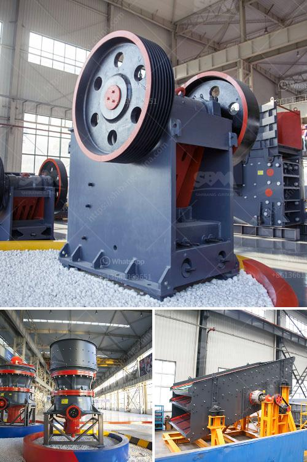

<h3>jaw crushers price south africa</h3>
Jaw crushers are one of the most popular equipment in the mining and construction industries. These machines are renowned for their ability to break down hard rocks and minerals into smaller particles for further processing. As a result, the demand for jaw crushers in South Africa is growing.

In recent years, with the rapid economic development in South Africa, the mining industry has also witnessed a boom. This has led to an increased demand for jaw crushers, as they are essential for breaking down large rocks and minerals into smaller particles. Jaw crushers are commonly used in the mining industry as primary crushers and are perfect for hard substances such as granite, basalt, and limestone.

When it comes to purchasing jaw crushers, prices can vary significantly depending on multiple factors. These factors include the brand, the capacity, the size of the machine, and the level of automation. In South Africa, jaw crushers are available in different sizes and capacities, ranging from 5-50 tons per hour to 900-1200 tons per hour.

The price range of jaw crushers in South Africa is approximately between ZAR 300,000 and ZAR 1,000,000. The price is relatively low compared to other countries. This price range is for the configuration of jaw crushers with a capacity of 500-800 tons per hour. Another factor that affects the price is the quality and longevity of the machine.

In South Africa, jaw crushers are predominately employed for mining projects. As these types of crushers reduce large rocks into smaller particles, they are generally used as primary crushers in mining operations. The jaw crusher crushes the ore feedstock by pressing it against a fixed jaw plate, which is located in a preferred position and at a suitable angle to the ore feedstock. The movement of the jaw plate helps in increasing the throughput capacity and also reduces wear and tear on the machine.

Apart from the mining industry, jaw crushers are also widely used in the construction industry. The building and construction materials industry in South Africa is growing rapidly, which is driving the demand for jaw crushers. These machines are used to crush and process various materials, such as granite, limestone, concrete, and asphalt, making them essential in the construction industry.

In conclusion, the demand for jaw crushers is on the rise in South Africa due to the boom in the mining and construction industry. Jaw crushers are powerful machines that break down hard rocks and minerals into smaller particles for further processing. The price ranges of jaw crushers in South Africa are between ZAR 300,000 and ZAR 1,000,000, relating to the various capacity requirements and output parameters. Jaw crushers are suitable for mining, construction, and recycling industries, and are commonly used in South Africa.
<h3>Contact us</h3><ul><li><strong>Whatsapp:&nbsp;<a href="https://wa.me/8613661969651">+8613661969651</a></strong></li><li><a href="https://swt.shibang-china.com/?git&amp;zhl&amp;jaw crushers price south africa"><strong>Online Service(chat now)</strong></a></li></ul><h3>Related</h3><ul><li><a href='crushing plant price list.md'>crushing plant price list</a></li><li><a href='rock quarrying in cameroon.md'>rock quarrying in cameroon</a></li><li><a href='hpc cone crusher.md'>hpc cone crusher</a></li><li><a href='manufacturer of vertical coal pulverizer mill.md'>manufacturer of vertical coal pulverizer mill</a></li><li><a href='crusher plant in malaysia.md'>crusher plant in malaysia</a></li></ul>