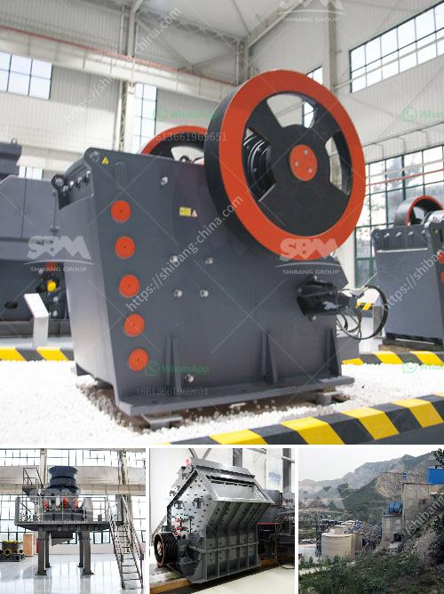

<h3>jaw industry limestone process in malaysia</h3>
The jaw industry in Malaysia plays a crucial role in the country's economic development. One of the primary resources used in this industry is limestone. Limestone is a sedimentary rock composed of calcium carbonate, which is abundant in Malaysia.

The limestone mining process is extensive, with various stages of crushing and screening to produce material in different sizes. The mining process includes blasting, hauling, crushing, screening, and stockpiling to produce limestone for use in the construction, power plant desulfurization, oil well drilling, and various other industries.

The raw limestone material extracted from the mine is too large for commercial use. Therefore, it needs to be crushed into smaller pieces to be utilized effectively. Jaw crushers are typically used as primary crushers, or the first step in the process of reducing rock. They are widely used in the mining industry, agricultural industry, construction industry, metallurgy industry, and chemical industry.

After the primary crushing stage, the crushed limestone will be transported to the vibrating screen for separating. After separation, the limestone particles that meet the specified size will be sent to the stockpile, while the larger particles will be returned to the jaw crusher for further crushing.

The limestone particles processed by the jaw crusher have a uniform particle size and can be directly used as raw materials for subsequent processes, reducing the need for secondary crushing and saving energy and cost.

In addition to the jaw crusher, limestone also can be processed by other crushing equipment such as the impact crusher, cone crusher, and hammer mill. However, the jaw crusher is preferred due to its lower cost and the ability to evenly crush large-sized samples.

Once the limestone has been crushed, it needs to be screened to separate the different sizes of particles. Vibrating screens are commonly used for this purpose, ensuring that the final product meets the required specifications.

Malaysia is a leading limestone producer in Southeast Asia. The limestone mines in Malaysia are scattered throughout the country, with varying amounts of distribution. Some areas in Peninsular Malaysia have high-quality limestone resources, while the states of Sabah and Sarawak in East Malaysia have abundant limestone deposits as well.

The limestone quarrying process starts with the extraction. It means removing blocks or pieces of stone from an identified and unearthed geologic deposit. Differences in the particular quarrying techniques used often stems from variations in the physical properties of the deposit itself. In Malaysia, extraction activities often involve the stripping of soil and vegetation to reach the rock layers underneath.

Overall, the jaw industry limestone process in Malaysia involves the process of extracting limestone from the ground, crushing it into useful sizes, and then screening it for various applications, such as in the construction, chemical, and power plant industries. The jaw industry plays a vital role in Malaysia's economic growth, providing employment opportunities and contributing to the country's overall development.
<h3>Contact us</h3><ul><li><strong>Whatsapp:&nbsp;<a href="https://wa.me/8613661969651">+8613661969651</a></strong></li><li><a href="https://swt.shibang-china.com/?git&amp;zhl&amp;jaw industry limestone process in malaysia"><strong>Online Service(chat now)</strong></a></li></ul><h3>Related</h3><ul><li><a href='raymond mill india price.md'>raymond mill india price</a></li><li><a href='price of grinder machine in malaysia.md'>price of grinder machine in malaysia</a></li><li><a href='grinding mill sale.md'>grinding mill sale</a></li><li><a href='cost of crushed concrete.md'>cost of crushed concrete</a></li><li><a href='ball mill machine price.md'>ball mill machine price</a></li></ul>