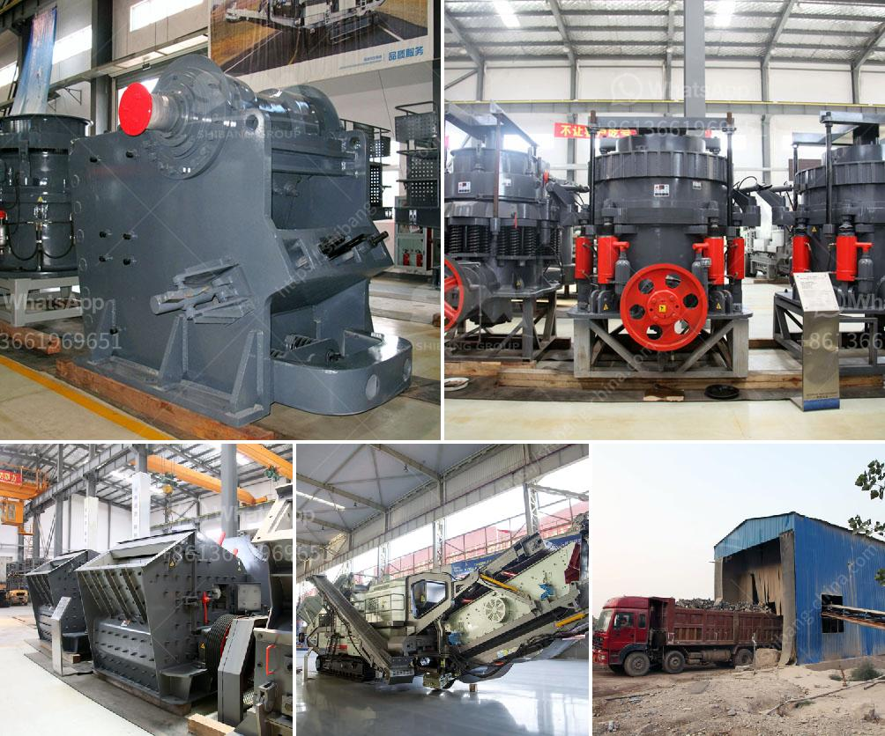

<h3>jual grinding mill hammer mill philippines</h3>
The Philippines is a country known for its vibrant agriculture industry. With fertile land and favorable climatic conditions, the country prides itself on producing a wide range of agricultural products, including grains, coffee beans, and sugarcane.

In order to maximize the value of these agricultural products, farmers and small-scale processors often rely on efficient milling equipment. One popular option is the jual grinding mill hammer mill. This versatile machine is widely used in the Philippines due to its ability to grind various materials, such as grains, corn, and rice husks, into fine powders suitable for animal feed or other industrial applications.

One key advantage of the jual grinding mill hammer mill is its high efficiency. This machine is designed to maximize the processing capacity while minimizing energy consumption. With its powerful motor and efficient grinding mechanism, the hammer mill can process large quantities of materials within a short period of time. This not only saves valuable time for farmers and processors, but also increases their productivity.

Furthermore, the jual grinding mill hammer mill offers great flexibility in terms of customization. It can be easily adjusted to meet the specific requirements of different materials and desired particle sizes. Whether you need a coarse or fine powder, this machine can deliver the desired results consistently.

In addition to its efficiency and versatility, the jual grinding mill hammer mill is also known for its durability. It is built with high-quality materials, such as hardened steel, to withstand the wear and tear of continuous operation. This ensures that the machine can handle the rigors of heavy-duty milling without compromising its performance.

If you are in the Philippines and looking for a reliable and efficient milling solution, the jual grinding mill hammer mill is definitely worth considering. Its high efficiency, flexibility, and durability make it an ideal choice for farmers and small-scale processors looking to maximize the value of their agricultural products. With this machine, you can transform grains, corn, and rice husks into fine powders that can be used for animal feed, manufacturing, or other purposes. Invest in the jual grinding mill hammer mill today and experience the benefits it brings to your milling operations.
<h3>Contact us</h3><ul><li><strong>Whatsapp:&nbsp;<a href="https://wa.me/8613661969651">+8613661969651</a></strong></li><li><a href="https://swt.shibang-china.com/?git&amp;zhl&amp;jual grinding mill hammer mill philippines"><strong>Online Service(chat now)</strong></a></li></ul><h3>Related</h3><ul><li><a href='single stage hammer crusher hot sale.md'>single stage hammer crusher hot sale</a></li><li><a href='crusher peru price crushing plant.md'>crusher peru price crushing plant</a></li><li><a href='aggregate washing plant.md'>aggregate washing plant</a></li><li><a href='jaw crusher with protection.md'>jaw crusher with protection</a></li><li><a href='cost of tonne per day cement plant.md'>cost of tonne per day cement plant</a></li></ul>