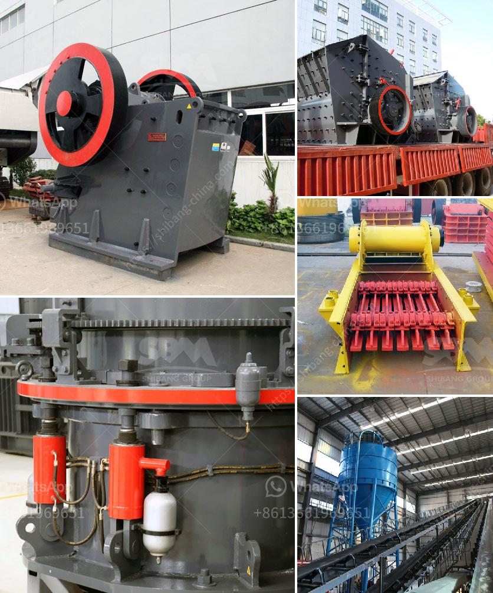

<h3>jual jaw crusher bekas surabaya</h3>
Jaw crushers are essential machines in the construction and mining industries. Their main purpose is to reduce the size of large rocks or ore into smaller pieces, thus facilitating transportation and subsequent processing. Jual jaw crusher bekas Surabaya offers significant advantages for businesses in the mining and construction industries.

With the increasing operational overheads, businesses are constantly seeking cost-effective solutions. Opting for a jual jaw crusher bekas Surabaya not only eliminates the need for new equipment but also significantly reduces capital expenditure. By purchasing a used jaw crusher, businesses can benefit from cost savings while still obtaining reliable and high-quality equipment.

Contrary to popular belief, used jaw crushers can provide the same performance as new ones. Many sellers who offer jual jaw crusher bekas Surabaya have conducted thorough inspections and repairs, ensuring that the machine is in optimal condition. Additionally, businesses can source used jaw crushers from reputable sellers who can provide technical specifications and guarantees, giving buyers peace of mind.

When time is of the essence, purchasing a used jaw crusher can be a prudent decision. New jaw crushers often have long lead times due to manufacturing processes, while jual jaw crusher bekas Surabaya offers immediate availability. Businesses can start benefiting from the machine's capabilities right away, speeding up construction or mining projects.

Another advantage of jual jaw crusher bekas Surabaya is the variety of options available. Sellers often have a wide range of used jaw crushers with different specifications, allowing businesses to choose the most suitable machine that fulfills their specific requirements. Whether it's the capacity, power, or feeding size, buyers can select the right jaw crusher tailored to their needs.

Purchasing used equipment helps to reduce waste and contributes to sustainable development. By opting for jual jaw crusher bekas Surabaya, businesses minimize their carbon footprint by avoiding the production of new machines. This environmentally friendly approach promotes the reuse and recycling of resources, supporting a greener future.

Jual jaw crusher bekas Surabaya offers several benefits for businesses in the construction and mining industries. This option provides a cost-efficient solution, ensuring high-quality equipment without the hefty price tag. Moreover, immediate availability, customizable options, and reduced environmental impact further enhance the appeal of purchasing used jaw crushers. Implementing sustainable practices while meeting operational needs is a win-win situation for businesses and the planet.
<h3>Contact us</h3><ul><li><strong>Whatsapp:&nbsp;<a href="https://wa.me/8613661969651">+8613661969651</a></strong></li><li><a href="https://swt.shibang-china.com/?git&amp;zhl&amp;jual jaw crusher bekas surabaya"><strong>Online Service(chat now)</strong></a></li></ul><h3>Related</h3><ul><li><a href='diagram of stone crusher operation.md'>diagram of stone crusher operation</a></li><li><a href='low cost gold mining equipment gold mining equipment.md'>low cost gold mining equipment gold mining equipment</a></li><li><a href='calcium carbonate crushing machine.md'>calcium carbonate crushing machine</a></li><li><a href='stone crush machine price in pakistan.md'>stone crush machine price in pakistan</a></li><li><a href='stone crusher plant management software.md'>stone crusher plant management software</a></li></ul>