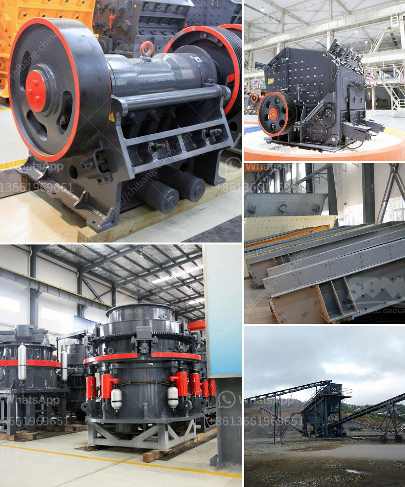

<h3>kaolin clay crusher manufacturing process</h3>
Kaolin clay, also known as China clay, is soft white clay that is an essential ingredient in the manufacturing of porcelain, paper, rubber, paint, and many other products. Kaolin clay is widely used around the world for its unique qualities and desirable properties. To meet the increasing demand for kaolin clay, manufacturers have started using advanced machinery to extract and process it efficiently. In this article, we will explore the manufacturing process of kaolin clay crusher.

The first step in the manufacturing process of kaolin clay is the extraction. Extracting kaolin clay is a complex task involving various processes such as mining, stripping, and backfilling. Once the process of extracting kaolin clay is complete, it is transported to the crusher for further processing.

The crusher breaks the large-sized kaolin clay chunks into smaller pieces of desired size. A jaw crusher is usually used as the primary crusher in the kaolin clay crushing plant. As mentioned above, it takes several steps to process kaolin clay, including flotation, drying, crushing, calcining, and classifying.

Firstly, kaolin clay is leveled into a powder by a crusher. The crushed kaolin clay particles are screened to remove oversized particles. The fine particles are further dispersed in water and undergo flotation. Depending on the desired grade, particle size, and whiteness, various flotation methods can be used. Once the kaolin clay particles are separated, they are dried to remove excess moisture.

After drying, the kaolin clay particles are crushed once again to achieve the desired particle size. This step is important as it ensures uniformity and consistency in the end product. The crushed kaolin clay particles are then calcined under high temperatures to remove any remaining impurities and improve its whiteness. Calcination also helps in creating a stable structure that enhances the properties of kaolin clay.

Finally, the kaolin clay is classified based on its particle size. The classified particles are packed into bags, ready for distribution and sale. Depending on the requirements of the customers, kaolin clay can also be further processed into various forms such as powder, slurry, or granules.

To ensure the quality of kaolin clay, manufacturers implement strict quality control measures throughout the manufacturing process. This includes regular testing of the raw materials, monitoring of process parameters, and quality checks of the final product. The aim is to produce kaolin clay that is free from impurities, has a consistent particle size, and meets the desired specifications.

In conclusion, the manufacturing process of kaolin clay crusher involves various steps such as extraction, flotation, drying, crushing, calcining, and classifying. Each step plays a crucial role in the overall production of high-quality kaolin clay. Manufacturers employ advanced machinery and technologies to ensure efficient and consistent processing of kaolin clay to cater to the increasing demand in various industries.
<h3>Contact us</h3><ul><li><strong>Whatsapp:&nbsp;<a href="https://wa.me/8613661969651">+8613661969651</a></strong></li><li><a href="https://swt.shibang-china.com/?git&amp;zhl&amp;kaolin clay crusher manufacturing process"><strong>Online Service(chat now)</strong></a></li></ul><h3>Related</h3><ul><li><a href='ball mill supplier in pune.md'>ball mill supplier in pune</a></li><li><a href='limestone field crushing plant.md'>limestone field crushing plant</a></li><li><a href='price of stone crusher in nigerian curency.md'>price of stone crusher in nigerian curency</a></li><li><a href='manganese ore processing machine price.md'>manganese ore processing machine price</a></li><li><a href='hammer mill indutrial price malaysia.md'>hammer mill indutrial price malaysia</a></li></ul>