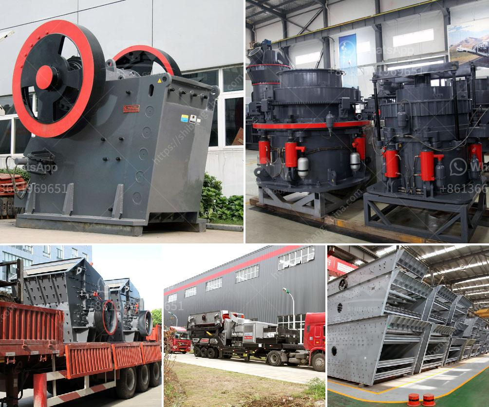

<h3>kaolin clay processing flow chart</h3>
Kaolin clay, also known as China clay, is a versatile and valuable resource for a wide range of industries. It is formed by the weathering of aluminum-rich rocks, such as feldspar, and is commonly used in the manufacturing of ceramics, paper, rubber, plastics, paints, and many other products. The processing of kaolin clay involves various stages to achieve the desired product.

The first step in the kaolin clay processing flow chart is to remove impurities such as rocks, clay minerals, and organic matter that are mixed with the kaolin clay. This can be done by a variety of methods including screening, froth flotation, or hydrocyclones.

Once the impurities are removed, the next step is to prepare the kaolin clay for processing. This involves crushing, grinding, and drying the clay to remove any moisture. The dried clay is then stored in silos or transported to the next stage of processing.

The next stage is classification, where the kaolin clay is separated into different particle sizes. This is typically done through a process called hydroclassification, where the clay is mixed with water and passed through a series of hydrocyclones. The different particle sizes are then separated based on their density, with the coarser particles settling out first.

After classification, the kaolin clay is typically subjected to further processing to improve its properties. This may include bleaching, where chemicals are used to remove any remaining impurities and improve the brightness of the clay. It may also involve calcining, where the clay is heated to remove any crystalline water and improve its strength and opacity.

Finally, the processed kaolin clay is ready to be used in various applications. It can be shaped into different forms, such as pellets, powder, or slurry, depending on the specific requirements of the end-use industry.

In conclusion, the processing of kaolin clay involves several stages to remove impurities, prepare the clay for processing, classify it into different particle sizes, and further improve its properties. This ensures that the kaolin clay meets the desired specifications and can be used effectively in various industries.
<h3>Contact us</h3><ul><li><strong>Whatsapp:&nbsp;<a href="https://wa.me/8613661969651">+8613661969651</a></strong></li><li><a href="https://swt.shibang-china.com/?git&amp;zhl&amp;kaolin clay processing flow chart"><strong>Online Service(chat now)</strong></a></li></ul><h3>Related</h3><ul><li><a href='jaw crusher engine and complete set.md'>jaw crusher engine and complete set</a></li><li><a href='roller mill pictures.md'>roller mill pictures</a></li><li><a href='apolo grinding mill price in india.md'>apolo grinding mill price in india</a></li><li><a href='chrome wash plant operational diagram.md'>chrome wash plant operational diagram</a></li><li><a href='komatsu crawler crusher.md'>komatsu crawler crusher</a></li></ul>