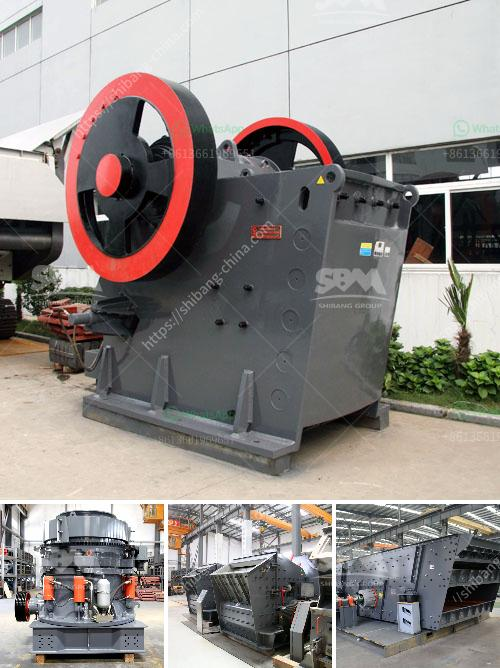

<h3>kaolin clay processing machinery</h3>
Kaolin clay, also known as China clay, is a versatile natural clay that is used in many industries and applications. The white clay is known for its high purity and desirable physical properties such as plasticity, strength, and whiteness. In order to obtain these qualities, kaolin clay goes through a complex processing method.

Kaolin clay processing machinery plays an irreplaceable role in the process of kaolin powder production. The main process includes crushing, grinding, dehydration, classification, and surface modification. The crushed raw ore is crushed to a certain size by a jaw crusher, the powdered material is uniformly sent to a ball mill for grinding, and then classified by a classifier. After that, the fine powder is sent to a high-efficiency thickener for dehydration, and finally, the product is dried, modified, and packaged.

High-quality kaolin clay processing machinery is essential for the whole manufacturing process. The equipment not only has high efficiency but also has great environmental performance. In the process of processing kaolin clay, the equipment should be able to effectively remove impurities such as iron, titanium, calcite, and quartz to achieve the desired product quality.

Various types of machinery are available for kaolin clay processing. For example, crushers such as jaw crushers, hammer crushers, and cone crushers are commonly used for coarse crushing. Ball mills, Raymond mills, and vertical mills are commonly used for fine grinding. Classifiers such as spiral classifiers and hydrocyclones are used for classification. High-efficiency thickeners, disc filters, and vacuum filters are commonly used for dehydration. Surface modification equipment such as pulverizers and coating machines are used for product modification.

In conclusion, kaolin clay processing machinery plays a crucial role in the production of high-quality kaolin powder. The equipment ensures efficient and effective processing, resulting in products that are highly sought after in various industries. With the help of advanced processing machinery, kaolin clay is utilized in areas such as ceramics, papermaking, coatings, plastics, rubber, and pharmaceuticals.
<h3>Contact us</h3><ul><li><strong>Whatsapp:&nbsp;<a href="https://wa.me/8613661969651">+8613661969651</a></strong></li><li><a href="https://swt.shibang-china.com/?git&amp;zhl&amp;kaolin clay processing machinery"><strong>Online Service(chat now)</strong></a></li></ul><h3>Related</h3><ul><li><a href='gyratory crusher price.md'>gyratory crusher price</a></li><li><a href='objectives of ball mill.md'>objectives of ball mill</a></li><li><a href='calcium bromide manufacturing process.md'>calcium bromide manufacturing process</a></li><li><a href='used granite crushers for sale.md'>used granite crushers for sale</a></li><li><a href='vertical roller mill coal.md'>vertical roller mill coal</a></li></ul>