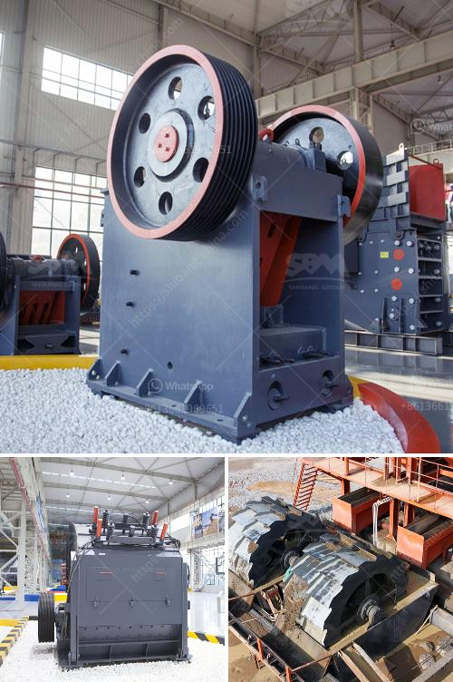

<h3>kaolin grinding mill</h3>
Kaolin, also known as china clay, is a white clay mineral with a high alumina content, which makes it the perfect raw material for manufacturing porcelain. It is widely used in the ceramics industry in the production of sanitary ware, tableware, and tiles. The demand for kaolin has been steadily increasing over the years, and as a result, the need for efficient grinding mills to process kaolin has become crucial.

One of the most popular grinding mills for kaolin is the Raymond mill, which is designed to grind kaolin to 80-325 mesh size. The structure of the mill is not complicated, and it is easy to operate and maintain. It takes only a few minutes to change the grinding ring and grinding roller, which saves production time and ensures stable product quality.

The Raymond mill can be used for coarse and fine grinding of kaolin. It has a strong ability to adjust the fineness of the finished product, which ensures the consistency and particle size distribution of the kaolin powder. In addition, the Raymond mill has a higher screening rate for the finished product, which can effectively control the impurities in the kaolin powder and improve its purity.

Compared with other grinding mills, the Raymond mill has a higher grinding efficiency and lower energy consumption. It uses a unique air circulation system to achieve the desired particle size and production capacity. The high-pressure centrifugal fan generates a large amount of air flow, which carries the ground material into the classifier for classification. The fine powder is collected by the dust collector, and the coarse powder is returned to the grinding chamber for re-grinding.

In conclusion, the kaolin grinding mill is an ideal equipment for processing kaolin. It not only improves the production capacity and crushing efficiency but also expands the application range of kaolin. The mill has the advantages of compact structure, stable performance, high grinding efficiency, low energy consumption, and easy operation and maintenance. With the continuous development of the kaolin industry, the demand for high-quality kaolin grinding mills is expected to increase significantly in the future.
<h3>Contact us</h3><ul><li><strong>Whatsapp:&nbsp;<a href="https://wa.me/8613661969651">+8613661969651</a></strong></li><li><a href="https://swt.shibang-china.com/?git&amp;zhl&amp;kaolin grinding mill"><strong>Online Service(chat now)</strong></a></li></ul><h3>Related</h3><ul><li><a href='crushers i want to build a crusher.md'>crushers i want to build a crusher</a></li><li><a href='coal mill in power plant.md'>coal mill in power plant</a></li><li><a href='crusher mill sales in malaysia.md'>crusher mill sales in malaysia</a></li><li><a href='list of cement factories in nepal.md'>list of cement factories in nepal</a></li><li><a href='price list of stone crusher plant.md'>price list of stone crusher plant</a></li></ul>