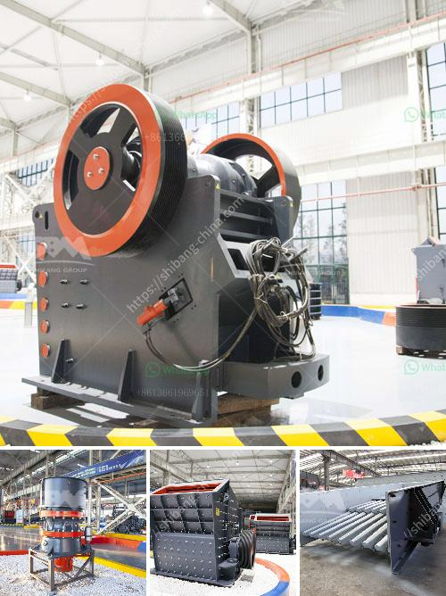

<h3>kaolin grinding plant manufacturer in india</h3>
Kaolin, also known as china clay, is a soft white clay that is abundantly found in India. It is widely used in the manufacturing of various products such as ceramics, paper, paints, rubber, and many more. To meet the growing demand for kaolin, Indian manufacturers are focusing on developing their kaolin grinding plant to produce higher quality kaolin for different industries.

Kaolin grinding plant manufacturer in India is a professional supplier of kaolin grinding mill, you can trust us, and we provide you with a grinder encompassing automation level that is only matched with higher levels of performance. Our focus is on process improvement and margin enhancement to maximize customer satisfaction.

The kaolin grinding plant we provide is capable of handling both dry and wet grinding operations. We also offer a complete guide on how to use the kaolin grinding plant effectively, ensuring that the product quality is maintained at its best. With our advanced technology and expertise in the field, we ensure that our customers get the best value for their investment.

Our kaolin grinding plant is equipped with the latest equipment and machinery, ensuring high productivity and efficiency. We also provide technical support, training, and assistance to our customers to help them make the most out of their kaolin grinding plant.

In addition, we adhere to strict quality control measures to ensure that our products meet international standards. Our kaolin grinding plant is designed to deliver the highest quality kaolin that is free from impurities and has a consistent particle size.

As a leading kaolin grinding plant manufacturer in India, we strive to provide our customers with comprehensive solutions that meet their specific requirements. Whether you are a small-scale manufacturer or a large industrial company, our kaolin grinding plant can be customized to suit your needs.

In conclusion, the kaolin grinding plant manufacturer in India plays a significant role in meeting the growing demand for kaolin in various industries. With advanced technology, superior quality, and excellent customer support, we aim to be your preferred partner for all your kaolin grinding needs.
<h3>Contact us</h3><ul><li><strong>Whatsapp:&nbsp;<a href="https://wa.me/8613661969651">+8613661969651</a></strong></li><li><a href="https://swt.shibang-china.com/?git&amp;zhl&amp;kaolin grinding plant manufacturer in india"><strong>Online Service(chat now)</strong></a></li></ul><h3>Related</h3><ul><li><a href='how to calculate the powder conveying rate.md'>how to calculate the powder conveying rate</a></li><li><a href='philippines crushing equipment for sale kenya.md'>philippines crushing equipment for sale kenya</a></li><li><a href='how to make clay powder.md'>how to make clay powder</a></li><li><a href='crushing plant for sale philippines.md'>crushing plant for sale philippines</a></li><li><a href='cement manufacturing process pdf.md'>cement manufacturing process pdf</a></li></ul>