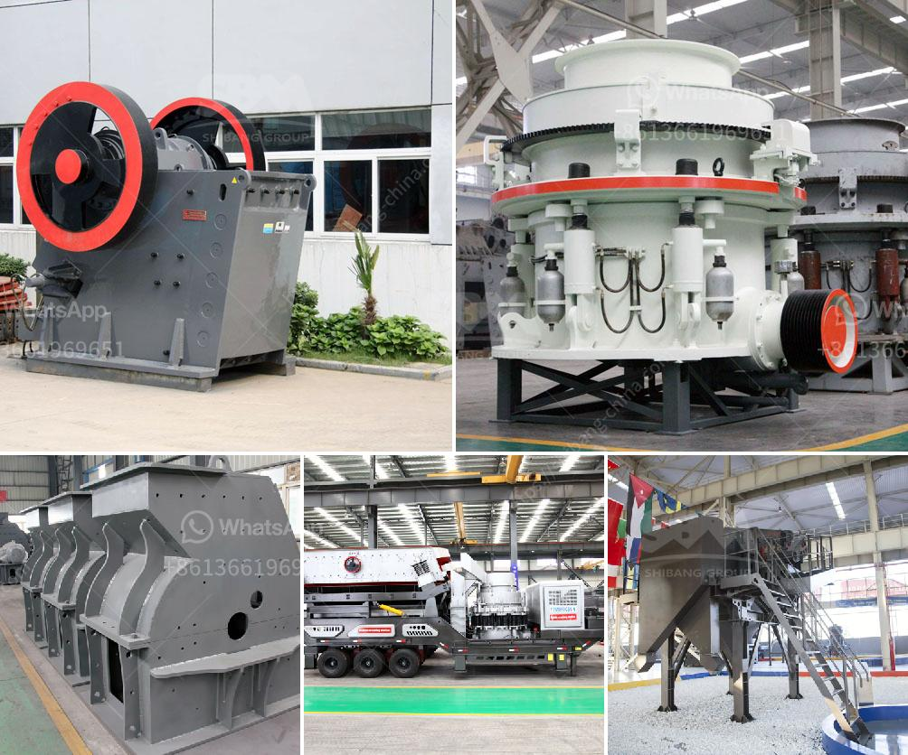

<h3>kenya cement plant</h3>
Kenya, the largest economy in East Africa, has witnessed significant infrastructure development in recent years. This growth has been augmented by the establishment of key cement plants across the country. One such notable plant is the Kenya Cement Plant, which has played a vital role in fostering economic development, creating employment opportunities, and contributing to Kenya's overall growth.

The Kenya Cement Plant, located strategically in one of the country's major industrial centers, has been operating successfully since its establishment. With modern infrastructure, state-of-the-art technology, and skilled manpower, the plant has become a symbol of progress and success for Kenya. It is equipped with advanced machinery that facilitates the production of high-quality cement, meeting both local and international standards.

One of the key advantages of the Kenya Cement Plant is its emphasis on sustainability and eco-friendliness. The plant adheres to environmentally conscious practices, ensuring minimal energy consumption, efficient waste management, and reduced emissions. By incorporating green technologies and promoting responsible manufacturing processes, the plant sets an example for other industries to follow.

The establishment of the Kenya Cement Plant has significantly contributed to Kenya's economy by generating employment opportunities. This plant has directly employed a substantial number of skilled and semi-skilled workers, providing them with a stable and respectable source of income. Additionally, the plant's presence has created a ripple effect, leading to the growth of ancillary industries and the establishment of supporting businesses, thus generating indirect employment as well.

Apart from employment generation, the Kenya Cement Plant has played a pivotal role in boosting the country's infrastructure development. The plant's production capacity meets a considerable portion of Kenya's cement demand, allowing for the timely completion of construction projects. The availability of affordable and high-quality cement has enabled the construction industry to flourish, leading to the development of roads, bridges, commercial complexes, and residential buildings across the country.

Furthermore, the Kenya Cement Plant has contributed to the country's revenue through taxation. The government receives substantial revenue from the plant's operations, which can be channeled towards public welfare programs, education, healthcare, and infrastructure development. This revenue also supports Kenya's development agenda, enabling the government to invest in key sectors and improve the standard of living for its citizens.

In conclusion, the Kenya Cement Plant stands as a testament to Kenya's commitment to inclusive growth and economic development. Through its sustainable practices, employment generation, contribution to infrastructure development, and revenue generation, the plant serves as a catalyst for progress. Looking ahead, it is essential to continue supporting such initiatives, ensuring the sustained growth of the cement industry in Kenya, and paving the way for a prosperous future for the nation.
<h3>Contact us</h3><ul><li><strong>Whatsapp:&nbsp;<a href="https://wa.me/8613661969651">+8613661969651</a></strong></li><li><a href="https://swt.shibang-china.com/?git&amp;zhl&amp;kenya cement plant"><strong>Online Service(chat now)</strong></a></li></ul><h3>Related</h3><ul><li><a href='how pyrite mined and processed.md'>how pyrite mined and processed</a></li><li><a href='portable concrete crusher rental maryland.md'>portable concrete crusher rental maryland</a></li><li><a href='horizontal impact crusher for sale.md'>horizontal impact crusher for sale</a></li><li><a href='cost of the project for 100 tph stone crushing unit.md'>cost of the project for 100 tph stone crushing unit</a></li><li><a href='crushers for sale in.md'>crushers for sale in</a></li></ul>