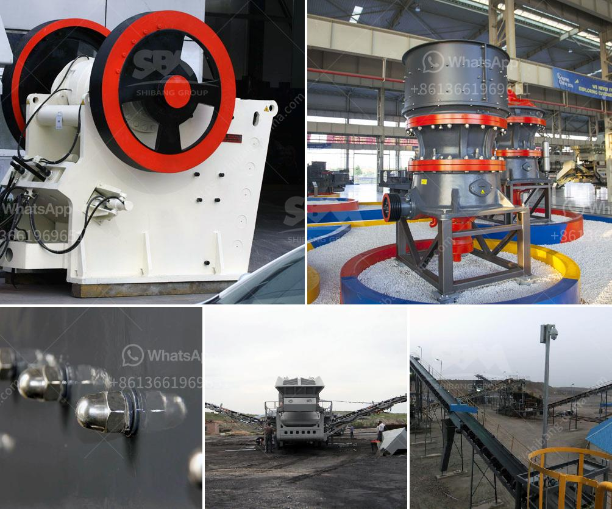

<h3>kenya quarry crusher</h3>
Kenya has been a significant player in the mining industry for decades, both as a producer and an exporter. It has a wealth of mineral resources, including gold, limestone, soda ash, salt, and gemstones. One of the key sectors that have benefited from the country's mining industry is the construction sector. The demand for building materials, such as stone aggregates, has been consistently high. This demand has created a need for efficient crushers, such as the Kenya quarry crusher.

The Kenya quarry crusher is an essential equipment in the mining industry. It plays a crucial role in the crushing and processing of materials for construction and other purposes. The machine crushes large rocks into smaller pieces, contributing to the production of quality stone aggregates and building materials used in construction projects. With a growing construction sector in Kenya, the demand for stone aggregates is only expected to increase, making the Kenya quarry crusher an integral part of the industry.

The Kenya quarry crusher is known for its strong structure, high efficiency, easy operation, and low energy consumption. It is equipped with a hydraulic mechanism that allows for quick and easy adjustments of the size of the output material. Additionally, the crusher is designed to withstand the harsh conditions of a quarrying environment, ensuring its durability and longevity. This makes it a reliable tool for continuous usage in the mining industry.

Furthermore, the Kenya quarry crusher has a low operating cost, making it a cost-effective solution for businesses in the industry. It requires minimal maintenance and is designed to maximize productivity. Its high crushing ratio ensures that the output material is of high quality and meets the required specifications. This, in turn, contributes to the overall efficiency and success of construction projects.

In conclusion, the Kenya quarry crusher is a vital equipment in the mining industry, particularly in the production of stone aggregates and building materials. With the high demand for these materials in construction projects, the crusher plays a crucial role in ensuring the availability of enough supply. Its strong structure, high efficiency, easy operation, low energy consumption, and cost-effectiveness make it an indispensable tool for mining operations in Kenya.
<h3>Contact us</h3><ul><li><strong>Whatsapp:&nbsp;<a href="https://wa.me/8613661969651">+8613661969651</a></strong></li><li><a href="https://swt.shibang-china.com/?git&amp;zhl&amp;kenya quarry crusher"><strong>Online Service(chat now)</strong></a></li></ul><h3>Related</h3><ul><li><a href='quarry crusher for sales in germany.md'>quarry crusher for sales in germany</a></li><li><a href='stone crusher prices german.md'>stone crusher prices german</a></li><li><a href='prices of vibrating screens.md'>prices of vibrating screens</a></li><li><a href='rock crusher cone for sale.md'>rock crusher cone for sale</a></li><li><a href='gold mining equipment company in japan.md'>gold mining equipment company in japan</a></li></ul>