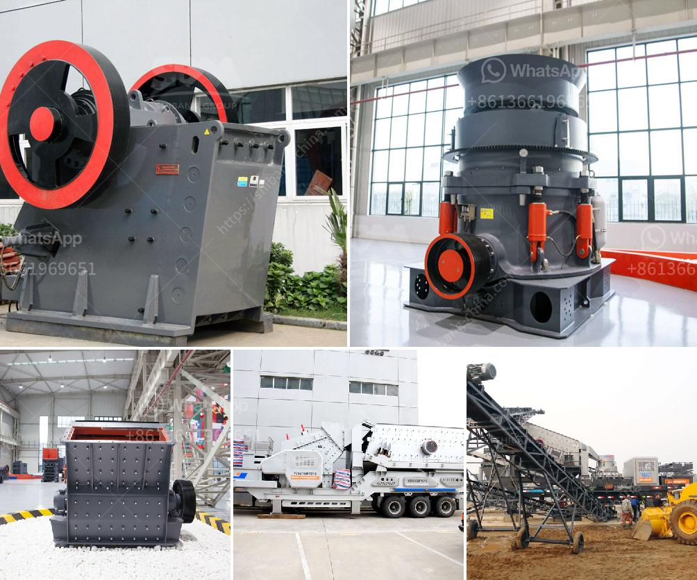

<h3>kenya quartz crushing</h3>
Kenya, located in East Africa, is known for its diverse landscapes, abundant wildlife, and vibrant culture. However, beneath its surface lies a hidden resource that has been gaining attention in recent years – quartz. Quartz crushing is a thriving industry in Kenya, with impressive results in both domestic and international markets.

Quartz, a type of mineral, is widely used in various industries due to its unique properties. It is primarily composed of silicon dioxide, making it a significant component in the production of glass, ceramics, and even electronics. Kenya is blessed with vast deposits of quartz, making it an ideal destination for quartz crushing operations.

The process of crushing quartz involves various steps to transform raw quartz into an end product that can be used in different applications. Initially, the quartz has to be extracted from the ground, either through surface mining or underground mining techniques. Once the quartz is extracted, it goes through a series of crushing stages to break it down into smaller particles.

Crushing and grinding the quartz not only reduces its physical size but also enhances its purity and quality. To achieve this, specialized machinery such as jaw crushers, cone crushers, and impact crushers are used. These machines apply compressive forces to break the quartz into smaller fragments, increasing surface area for further processing.

After the initial crushing stage, the quartz is carefully sorted and graded to remove impurities. This is done through sieving, magnetic separation, and chemical treatments. The aim is to obtain high-purity quartz that meets specific industry standards. The graded quartz is then processed further to meet specific customer requirements, such as a particular size or purity level.

The quartz crushing industry in Kenya has witnessed significant growth in recent years. This is due to several factors, including the country's accessible quartz reserves, a skilled workforce, and a strategic location for exporting. Additionally, Kenya has been working towards improving its infrastructure, making it easier for quartz crushing companies to transport their products domestically and for export.

Kenyan quartz crushing companies have also expanded their operations to international markets. Their products are exported to various countries, including the United States, Europe, and Asia. This expansion has not only boosted Kenya's economy, but it has also put the country on the map as a reliable source of high-quality quartz.

The quartz crushing industry in Kenya has also contributed to job creation and poverty alleviation. By providing employment opportunities to local communities, it has improved living standards and fostered economic growth. Furthermore, the industry has enhanced skills development and technology transfer, as companies have invested in training programs and modern machinery.

However, challenges remain. The quartz crushing industry in Kenya faces competition from other quartz-producing countries, such as Brazil, China, and India. To maintain its competitive edge, Kenya needs to invest in research and development to improve the quality and value-added aspects of its quartz products. Market diversification and exploring new applications of quartz could also help expand the industry's scope.

In conclusion, quartz crushing has become a thriving industry in Kenya, bringing economic benefits to the country and its people. With its abundant quartz reserves, skilled workforce, and improving infrastructure, Kenya continues to attract domestic and international investors. By addressing challenges and focusing on innovation, the Kenyan quartz crushing industry can further cement its position in the global market.
<h3>Contact us</h3><ul><li><strong>Whatsapp:&nbsp;<a href="https://wa.me/8613661969651">+8613661969651</a></strong></li><li><a href="https://swt.shibang-china.com/?git&amp;zhl&amp;kenya quartz crushing"><strong>Online Service(chat now)</strong></a></li></ul><h3>Related</h3><ul><li><a href='grinding mill grinding machine grinders grinning mill.md'>grinding mill grinding machine grinders grinning mill</a></li><li><a href='raymond grinding mill manufacturers india.md'>raymond grinding mill manufacturers india</a></li><li><a href='granite crusher cost.md'>granite crusher cost</a></li><li><a href='machine price list ball mill for silica sand.md'>machine price list ball mill for silica sand</a></li><li><a href='stone crusher conveyor belts.md'>stone crusher conveyor belts</a></li></ul>