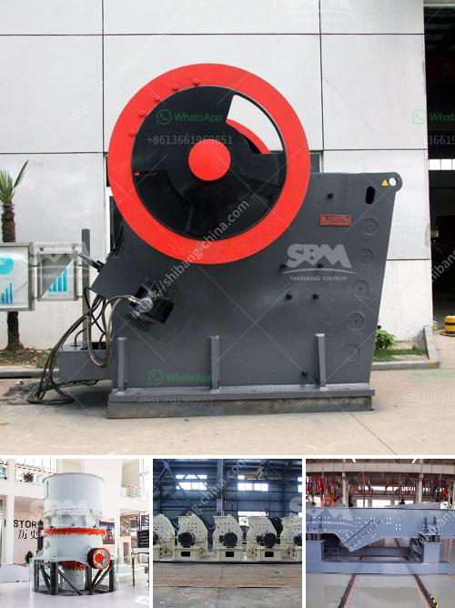

<h3>kenya regular impact crusher</h3>
In Kenya, the usage of impact crushers is a popular trend for the crushing of various materials. From limestone to basalt, these machines are capable of efficiently breaking down a wide range of materials. The Kenya regular impact crusher is specifically designed to meet the unique demands of the local market, ensuring reliable performance and high productivity.

One of the key features of the Kenya regular impact crusher is its versatility. Whether it is used for primary crushing, secondary crushing, or even tertiary crushing, this machine can handle it all. The adjustable impact plates and the multiple rotor configurations allow for a precise and customized control over the final product size. This makes the impact crusher suitable for a variety of applications in various industries, such as construction, mining, and quarrying.

Another advantage of the Kenya regular impact crusher is its efficiency. Equipped with a powerful motor and a robust design, this machine delivers high production capacity and throughput. The unique hammer locking system ensures a secure and reliable operation, minimizing downtime and maximizing productivity. Additionally, the easy maintenance and quick access to wear parts simplify the maintenance process, reducing operational costs.

Safety is also a top priority in the design of the Kenya regular impact crusher. The machine is equipped with advanced safety features, such as a hydraulic opening mechanism for easy access to the crushing chamber. This allows for quick and safe inspection and maintenance, reducing the risk of accidents and injuries.

In conclusion, the Kenya regular impact crusher is a versatile and efficient crushing machine that offers a reliable solution for a wide range of applications. Its versatility, efficiency, and safety features make it a desirable choice for businesses in Kenya. Whether it is used for primary, secondary, or tertiary crushing, this machine delivers consistent performance and high productivity. With its robust design and easy maintenance, the impact crusher is built to withstand the demanding operating conditions of the local market.
<h3>Contact us</h3><ul><li><strong>Whatsapp:&nbsp;<a href="https://wa.me/8613661969651">+8613661969651</a></strong></li><li><a href="https://swt.shibang-china.com/?git&amp;zhl&amp;kenya regular impact crusher"><strong>Online Service(chat now)</strong></a></li></ul><h3>Related</h3><ul><li><a href='gold milling machine for sale in south africa.md'>gold milling machine for sale in south africa</a></li><li><a href='sand beneficiation plant technology.md'>sand beneficiation plant technology</a></li><li><a href='calcium carbonate proses by process.md'>calcium carbonate proses by process</a></li><li><a href='kaolin clay processing flow chart.md'>kaolin clay processing flow chart</a></li><li><a href='grinding machine manufacturers from europe.md'>grinding machine manufacturers from europe</a></li></ul>