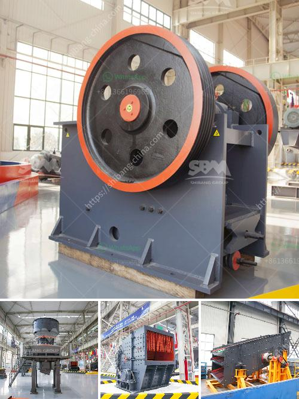

<h3>kokstad grinding mill for sale</h3>
When it comes to finding the perfect grinding mill for your business or personal use, look no further than Kokstad Grinding Mill. Located in the heart of Kokstad, this reliable and reputable mill is committed to providing customers with top-quality grinding solutions that meet their specific needs.

One of the key features that sets Kokstad Grinding Mill apart from its competitors is its wide range of grinding options. Whether you need to grind wheat, corn, or any other grains, this mill has got you covered. With its state-of-the-art machinery and equipment, the mill ensures that each grain is ground to perfection, resulting in high-quality flour and meal.

Not only does Kokstad Grinding Mill boast an extensive range of grinding options, but it also offers competitive prices. As a locally-owned business, the mill understands the importance of affordability without compromising on quality. This means that you can purchase your desired grinding solutions without breaking the bank.

Another major benefit of choosing Kokstad Grinding Mill is its impeccable customer service. The mill's dedicated and knowledgeable staff are always ready to assist you with any queries or concerns you may have. From offering expert advice on grinding options to providing guidance on maintenance and upkeep, they go above and beyond to ensure customer satisfaction.

In addition to providing top-notch products and exceptional customer service, Kokstad Grinding Mill also offers durable and sturdy machinery. Each grinder is made from high-grade materials, ensuring long-lasting efficiency and durability. This allows you to rely on your grinding mill for years to come, knowing that it will continue to deliver excellent results.

Whether you're a small business owner in need of a reliable grinding solution or an individual looking to elevate your cooking skills, Kokstad Grinding Mill is the go-to destination for all your grinding needs. With its wide range of grinding options, competitive prices, exceptional customer service, and durable machinery, this mill is the epitome of quality and reliability.

Don't compromise on the quality of your ground grains. Visit Kokstad Grinding Mill today and experience the difference it can make in your grinding process.
<h3>Contact us</h3><ul><li><strong>Whatsapp:&nbsp;<a href="https://wa.me/8613661969651">+8613661969651</a></strong></li><li><a href="https://swt.shibang-china.com/?git&amp;zhl&amp;kokstad grinding mill for sale"><strong>Online Service(chat now)</strong></a></li></ul><h3>Related</h3><ul><li><a href='business plan for small scale chrome mining crusher.md'>business plan for small scale chrome mining crusher</a></li><li><a href='gypsum calcining equipment price.md'>gypsum calcining equipment price</a></li><li><a href='gypsum manufacturing plant.md'>gypsum manufacturing plant</a></li><li><a href='chrome sands washing plant with prices.md'>chrome sands washing plant with prices</a></li><li><a href='parts for stone crushers.md'>parts for stone crushers</a></li></ul>