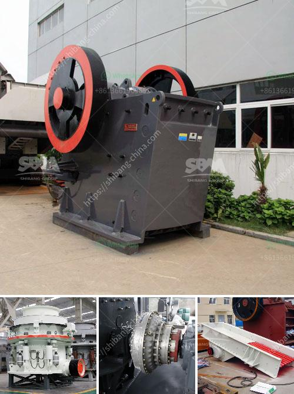

<h3>komatsu crawler crusher</h3>
Crawler crushers are highly efficient and cost-effective machines that are known for their ability to work in demanding conditions. The Komatsu crawler crusher is renowned for its use in reducing a wide variety of materials, such as rocks, damp clay, and vegetation, regardless of the terrain. With its excellent productivity and moving capabilities, the Komatsu crawler crusher is an ideal machine for a wide range of industries and applications.

One of the standout features of the Komatsu crawler crusher is its versatility. It can be used in various applications, from mining and construction to demolition and recycling. Whether it's crushing rocks in a quarry or pulverizing concrete in a demolition site, the Komatsu crawler crusher delivers consistent, reliable performance.

Another key advantage of the Komatsu crawler crusher is its exceptional power and efficiency. Equipped with a powerful engine, the crusher can tackle the toughest of materials while maximizing fuel efficiency. This translates to reduced operating costs and increased profitability for businesses.

The Komatsu crawler crusher also boasts a high level of maneuverability, thanks to its advanced tracks and undercarriage system. Designed to navigate through uneven terrains and slippery surfaces, the crawler crusher can easily move around construction sites or transport materials to different locations. This eliminates the need for additional equipment or transportation, saving time and money.

To further enhance its efficiency, the Komatsu crawler crusher is equipped with advanced crushing technology. It features a large crushing chamber that ensures efficient and high-quality crushing of materials. Additionally, the crusher is equipped with a hydraulic system that allows for easy and quick adjustment of the crusher settings. This ensures optimal performance and productivity, even when dealing with different types of materials.

Safety is always a top priority in the construction and mining industries, and the Komatsu crawler crusher doesn't disappoint. It is designed with multiple safety features to protect operators and prevent accidents. These features include a reinforced cabin with excellent visibility, emergency stop buttons, and audible alarms. Additionally, the crusher is equipped with a dust suppression system to minimize dust emissions, ensuring a safer and healthier working environment.

Regular maintenance is essential for the long-term performance and durability of any machine, and the Komatsu crawler crusher is no exception. It is designed with ease of maintenance in mind. Key components are easily accessible, allowing for quick inspections and servicing. This helps to reduce downtime and keep the machine running efficiently.

In conclusion, the Komatsu crawler crusher stands out as a reliable and efficient machine that is well-suited for a wide range of applications. From its versatility to its power and maneuverability, this machine delivers exceptional performance in demanding conditions. With its advanced crushing technology, safety features, and ease of maintenance, the Komatsu crawler crusher is a valuable tool for any industry looking to enhance productivity and profitability.
<h3>Contact us</h3><ul><li><strong>Whatsapp:&nbsp;<a href="https://wa.me/8613661969651">+8613661969651</a></strong></li><li><a href="https://swt.shibang-china.com/?git&amp;zhl&amp;komatsu crawler crusher"><strong>Online Service(chat now)</strong></a></li></ul><h3>Related</h3><ul><li><a href='drums of conveyor belts malaysia.md'>drums of conveyor belts malaysia</a></li><li><a href='cost gypsum processing machines.md'>cost gypsum processing machines</a></li><li><a href='harga stone crusher 250 ton.md'>harga stone crusher 250 ton</a></li><li><a href='grinding zeolite ball mill machine.md'>grinding zeolite ball mill machine</a></li><li><a href='manufacturing process of portland slag cement.md'>manufacturing process of portland slag cement</a></li></ul>