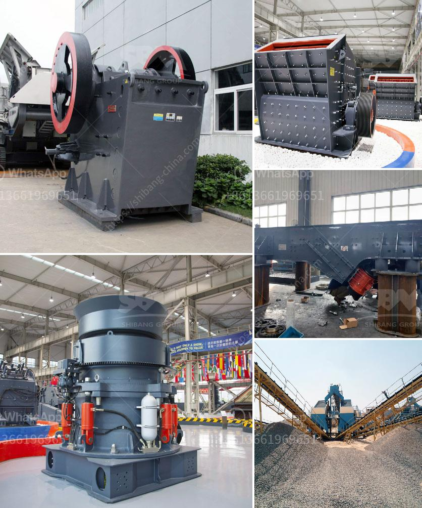

<h3>komatsu mobile impact crusher</h3>
The robust Komatsu Mobile Impact Crusher, impressively durable and sturdy, is designed to provide extreme levels of precision in any environment. The mobile crusher is ideal for use in such natural disasters as a landslide, hurricane, or earthquake, which are common in specific regions across the world.

By using the Komatsu Mobile Impact Crusher, operators can effectively process construction waste, concrete, asphalt, and other harsh materials with ease. This machine utilizes a sturdy construction, ensuring the highest level of reliability when crushing even the toughest materials.

Equipped with powerful components, the Komatsu Mobile Impact Crusher delivers high productivity while maintaining impressive fuel efficiency. This crusher operates on a powerful engine, ensuring minimal emissions and maximum efficiency for any job site.

One of the most notable features of the Komatsu Mobile Impact Crusher is its ability to transport easily and quickly. With four hydraulic outriggers operated through a radio control, the crusher can be set up and ready to start processing in a matter of minutes.

The versatility of the Komatsu Mobile Impact Crusher ensures it can handle a wide range of applications. This crusher is capable of crushing construction waste, aggregates, and even ores. The impact chamber is designed for maximum reduction and high performance, while ensuring quick and efficient processing.

The user-friendly control panel allows operators to monitor and adjust various settings to optimize performance and meet desired specifications. This includes adjusting the speed of the rotor, controlling the feed rate, and even changing the settings to achieve different aggregate sizes.

Overall, the Komatsu Mobile Impact Crusher offers professionals an efficient and reliable solution for processing a variety of materials. Its durable construction, high productivity, and powerful engine make it an essential tool for any construction or demolition site.

With this crusher, operators can reduce waste, recycle materials, and achieve high-quality aggregates, ultimately saving time and money. The Komatsu Mobile Impact Crusher sets a new standard for productivity, versatility, and efficiency in the industry, paving the way for future advancements and innovation.
<h3>Contact us</h3><ul><li><strong>Whatsapp:&nbsp;<a href="https://wa.me/8613661969651">+8613661969651</a></strong></li><li><a href="https://swt.shibang-china.com/?git&amp;zhl&amp;komatsu mobile impact crusher"><strong>Online Service(chat now)</strong></a></li></ul><h3>Related</h3><ul><li><a href='processing plant for chrome for sale.md'>processing plant for chrome for sale</a></li><li><a href='mineral crushing plant.md'>mineral crushing plant</a></li><li><a href='crushers equipment dealer in saudi arabia.md'>crushers equipment dealer in saudi arabia</a></li><li><a href='how much is a ball mill.md'>how much is a ball mill</a></li><li><a href='stone crusher jaw mini produksi indonesia.md'>stone crusher jaw mini produksi indonesia</a></li></ul>