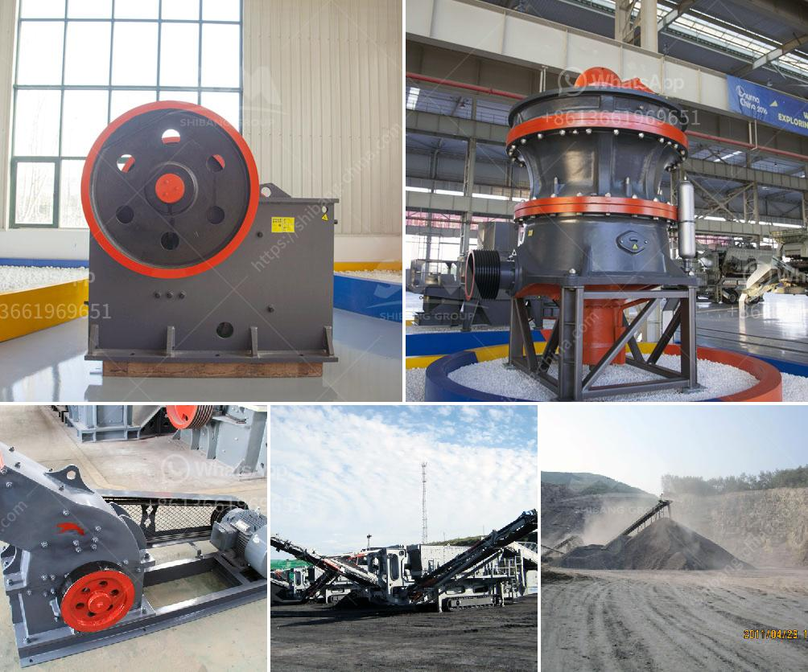

<h3>lime and dolomite plant in india</h3>
India, known for its rapid industrialization and robust infrastructure development, has seen a significant growth in the steel production sector in recent years. And at the heart of this booming industry lies the lime and dolomite plant, a critical facility that plays a pivotal role in both steelmaking and agricultural practices.

Lime and dolomite, also known as calcium and magnesium carbonates, are essential components in various industrial processes, especially in steel production. These minerals act as flux, which helps remove impurities and purifies the iron ore during the smelting process. Without lime and dolomite, it would be nearly impossible to achieve the desired quality and strength of steel.

Moreover, lime and dolomite also play a crucial role in agriculture. Farmers across India embrace the use of lime and dolomite to enhance soil health and fertility. These minerals neutralize the soil's acidity, balance the pH levels, and provide essential nutrients like calcium and magnesium to crops. By incorporating lime and dolomite into the soil, farmers can improve plant growth, enhance nutrient absorption, and increase overall agricultural productivity.

One of the prominent lime and dolomite plants in India is located in Rajasthan, a state known for its rich mineral resources. This plant operates state-of-the-art technology, adhering to strict quality control measures to deliver high-purity lime and dolomite products. The facility utilizes advanced production processes, ensuring minimal environmental impact and efficient resource utilization.

The lime and dolomite plant in India has brought numerous benefits to the steel industry and agricultural sector. With its consistent supply of flux materials, steel manufacturers can maintain optimal production rates and deliver high-quality steel products to meet growing demand. Additionally, the availability of lime and dolomite products significantly contributes to the overall improvement in soil health, leading to better crop yields and sustainable agriculture.

In conclusion, the lime and dolomite plant in India serves as a fundamental pillar of the steel production industry and agricultural practices. Its importance cannot be overstated, as it ensures the supply of flux materials to produce high-quality steel and plays a significant role in enhancing soil health and agricultural productivity. With continuous advancements in technology and adherence to environmental sustainability, the lime and dolomite plant in India is poised to further enhance the country's industrial growth and agricultural success.
<h3>Contact us</h3><ul><li><strong>Whatsapp:&nbsp;<a href="https://wa.me/8613661969651">+8613661969651</a></strong></li><li><a href="https://swt.shibang-china.com/?git&amp;zhl&amp;lime and dolomite plant in india"><strong>Online Service(chat now)</strong></a></li></ul><h3>Related</h3><ul><li><a href='mobile crushers in abuja.md'>mobile crushers in abuja</a></li><li><a href='best grinding pads for marble in pakistan.md'>best grinding pads for marble in pakistan</a></li><li><a href='stone crusher machine price in uganda.md'>stone crusher machine price in uganda</a></li><li><a href='cement manufacturing process pdf.md'>cement manufacturing process pdf</a></li><li><a href='stone medina stone mobile crusher.md'>stone medina stone mobile crusher</a></li></ul>