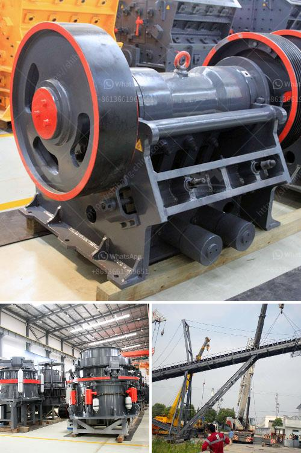

<h3>lime production plant</h3>
Lime is an essential ingredient used in a variety of industries, ranging from construction and agriculture to water treatment and chemicals. Its production process involves the heating of limestone or dolomite to create quicklime or calcium oxide. With the increasing demand for lime and growing environmental concerns, the establishment of a lime production plant can offer sustainable solutions for a greener future.

One of the main advantages of a lime production plant is its potential to reduce carbon emissions. Traditional lime production methods release large amounts of carbon dioxide (CO2) through the process of calcination. However, modern lime production plants can employ innovative technologies such as carbon capture and storage (CCS) to capture CO2 emissions and prevent their release into the atmosphere. This not only helps in mitigating climate change but also reduces air pollution.

Furthermore, lime production plants can leverage renewable energy sources to power the manufacturing process. By utilizing solar, wind, or hydroelectric energy, these plants can significantly reduce their reliance on fossil fuels and decrease their carbon footprint. Renewable energy integration not only helps meet sustainability targets but also provides a cost-effective solution in the long run, as it reduces energy expenses and minimizes the impact of energy price fluctuations.

In addition to environmental benefits, lime production plants contribute to the circular economy by converting waste materials into valuable byproducts. For example, lime kilns can utilize various industrial waste materials, such as fly ash from coal-fired power plants and slag from steel production, as feedstock. By transforming these waste materials into useful products like quicklime or hydrated lime, lime production plants help reduce landfill waste and create economic value from materials that would otherwise be discarded.

The establishment of a lime production plant can also have positive socioeconomic impacts, particularly in rural areas. These plants typically require a significant labor force, providing job opportunities for local communities. Additionally, the growth of lime production plants can contribute to regional economic development through increased demand for raw materials, transportation services, and support industries.

To ensure sustainable lime production, it is crucial to implement measures to minimize environmental impact throughout the entire production process. This includes optimizing resource management, such as efficient water usage and land rehabilitation to mitigate the impacts on local ecosystems. Moreover, regular monitoring and compliance with environmental regulations are necessary to ensure that the plant operates within acceptable limits and does not harm the surrounding environment.

In conclusion, the establishment of a lime production plant can offer sustainable solutions for a greener future. By adopting innovative technologies, utilizing renewable energy sources, and transforming waste materials into valuable byproducts, these plants can reduce carbon emissions, contribute to the circular economy, and create socioeconomic opportunities. However, it is essential to prioritize environmental stewardship and adherence to regulations to achieve sustainable and responsible lime production. With the implementation of these measures, lime production plants can lead the way towards a more sustainable and environmentally friendly future.
<h3>Contact us</h3><ul><li><strong>Whatsapp:&nbsp;<a href="https://wa.me/8613661969651">+8613661969651</a></strong></li><li><a href="https://swt.shibang-china.com/?git&amp;zhl&amp;lime production plant"><strong>Online Service(chat now)</strong></a></li></ul><h3>Related</h3><ul><li><a href='prices of iron ore crushers.md'>prices of iron ore crushers</a></li><li><a href='bauxite crusher machine.md'>bauxite crusher machine</a></li><li><a href='how to maintain stone crusher daily accounts in tally.md'>how to maintain stone crusher daily accounts in tally</a></li><li><a href='mobile crusher plant for hire in mpumalanga province.md'>mobile crusher plant for hire in mpumalanga province</a></li><li><a href='balls mill for limestone.md'>balls mill for limestone</a></li></ul>