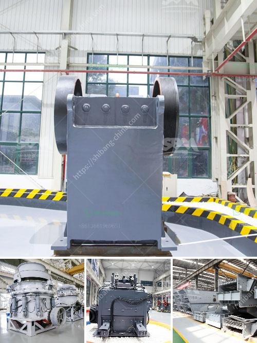

<h3>lime stone pulverizer machine manufacturers</h3>
Limestone is a sedimentary rock that is mainly composed of calcium carbonate, also known as calcite. Many limestone deposits contain fossils, making them valuable for paleontological research as well. Limestone has numerous applications in various industries, which has led to the rise in demand for limestone pulverizer machines.

Limestone pulverizer machines are machines that are used to grind or crush limestone into fine particles. These machines are commonly used in the construction, mining, and chemical industries. Lime stone pulverizer machines are designed to reduce the size of limestone to achieve a desired particle size.

There are several manufacturers that produce lime stone pulverizer machines. Each manufacturer offers a range of machines with different specifications and capabilities. These machines come in various sizes and designs to cater to the diverse needs of customers.

One of the leading manufacturers of limestone pulverizer machines is [Manufacturer Name]. They have been in the industry for [Number of Years] and have gained a reputation for producing high-quality and reliable machines. The company offers a wide range of pulverizer machines, including [Model Name/Number], [Model Name/Number], and [Model Name/Number]. These machines are known for their robust construction, efficient performance, and low maintenance requirements.

Another reputable manufacturer in the industry is [Manufacturer Name]. They have been manufacturing limestone pulverizer machines for [Number of Years] and have a strong customer base. Their machines are known for their precision grinding, excellent particle size control, and energy efficiency.

When selecting a limestone pulverizer machine manufacturer, it is important to consider factors such as machine quality, reliability, after-sales support, and pricing. It is advisable to choose a manufacturer that has a good track record, positive customer reviews, and a wide range of machines to choose from.

In conclusion, limestone pulverizer machines play a crucial role in various industries where limestone is used. These machines help in reducing the size of limestone to achieve a desired particle size. There are several reputable manufacturers in the industry that offer high-quality and reliable machines for customers to choose from. When selecting a manufacturer, it is important to consider factors such as machine quality, reliability, after-sales support, and pricing.
<h3>Contact us</h3><ul><li><strong>Whatsapp:&nbsp;<a href="https://wa.me/8613661969651">+8613661969651</a></strong></li><li><a href="https://swt.shibang-china.com/?git&amp;zhl&amp;lime stone pulverizer machine manufacturers"><strong>Online Service(chat now)</strong></a></li></ul><h3>Related</h3><ul><li><a href='feldspar production plant.md'>feldspar production plant</a></li><li><a href='stone medina stone mobile crusher.md'>stone medina stone mobile crusher</a></li><li><a href='vibrating screen in cement plant.md'>vibrating screen in cement plant</a></li><li><a href='mica processing plant in jharkhand.md'>mica processing plant in jharkhand</a></li><li><a href='size pe 600x900 jaw crusher.md'>size pe 600x900 jaw crusher</a></li></ul>