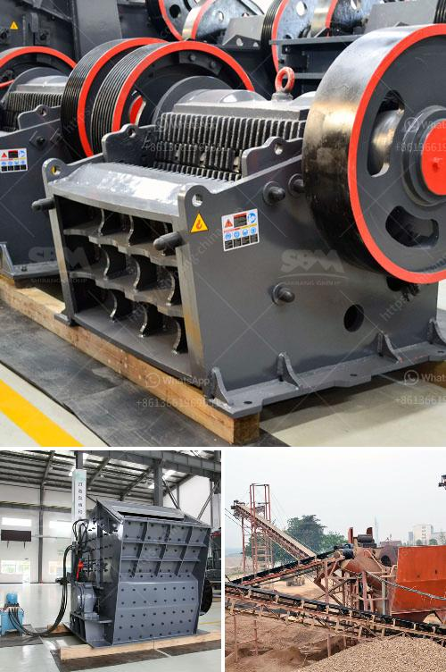

<h3>limestone belt conveyor</h3>
A limestone belt conveyor is a type of material handling equipment used to transport limestone from one point to another. The conveyor is comprised of a belt that is capable of moving up to 300 tons of limestone per hour, which makes it a reliable and high-capacity option for larger-scale operations.

The limestone belt conveyor offers several advantages for efficient transportation. One of the primary benefits is its ability to navigate a variety of terrains and angles, including inclines and declines. This flexibility allows for the transport of limestone across various landscapes, such as hilly or uneven terrains. The conveyor can also be easily adjusted to accommodate different incline angles, ensuring the limestone is transported smoothly and without spillage.

Additionally, the limestone belt conveyor is designed to handle different sizes and types of limestone. This is achieved through customizable belt widths and lengths, as well as adjustable belt tensioning systems. These features ensure that limestone of various sizes can be effectively transported without any damage to the material or the conveyor itself.

Another advantage of the limestone belt conveyor is its durability and low maintenance requirements. The conveyor is constructed using high-quality materials that are resistant to wear and tear, ensuring a long service life and reducing the need for frequent repairs or replacements. Maintenance tasks, such as belt tension adjustments or routine inspections, are relatively simple and can be easily carried out by trained personnel.

In conclusion, a limestone belt conveyor is a reliable and efficient solution for transporting limestone in large-scale operations. Its versatility, durability, and low maintenance requirements make it an ideal choice for industries such as mining, cement production, and construction. With its ability to handle various terrains and limestone sizes, this conveyor offers a cost-effective method of transporting limestone with minimal downtime or material spillage.
<h3>Contact us</h3><ul><li><strong>Whatsapp:&nbsp;<a href="https://wa.me/8613661969651">+8613661969651</a></strong></li><li><a href="https://swt.shibang-china.com/?git&amp;zhl&amp;limestone belt conveyor"><strong>Online Service(chat now)</strong></a></li></ul><h3>Related</h3><ul><li><a href='cara perhitungan hasil produksi stone crusher.md'>cara perhitungan hasil produksi stone crusher</a></li><li><a href='trapizium mill for purvelising.md'>trapizium mill for purvelising</a></li><li><a href='stone crusher business plan.md'>stone crusher business plan</a></li><li><a href='toggle jaw crusher.md'>toggle jaw crusher</a></li><li><a href='concrete recycling equipment manufacturers.md'>concrete recycling equipment manufacturers</a></li></ul>