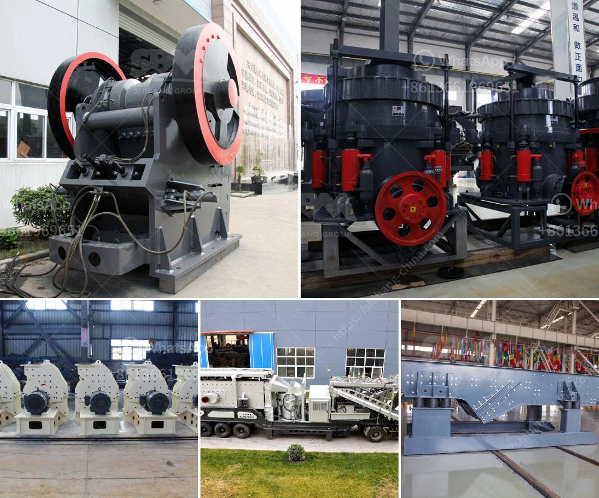

<h3>limestone crusher equipment</h3>
Limestone is a sedimentary rock composed mostly of the mineral calcite and comprising about 15% of the Earth's sedimentary crust. It is a basic building block of the construction industry (dimension stone) and a chief material from which aggregate, cement, lime, and building stone are made. 71% of all crushed stone produced in the U.S. is either limestone or dolomite.

As a source for lime, it is used to make paper, plastics, glass, paint, steel, cement, carpets, used in water treatment and purification plants, and in the processing of various foods and household items (including medicines).

In recent years, limestone crushers have been increasingly used in cement production lines. Many types of crushers can be used to crush limestone, including jaw crushers, impact crushers, and roller crushers. Different crushers have different crushing effects. To ensure the choice of the right equipment for the application, it is necessary to use the manufacturer's reference.

The feed size of the limestone crusher is small, and the discharge granularity can be adjusted arbitrarily between 0-40mm. Due to the limitat5ion of the crushing equipment's grinding ratio and processing capacity, the maximum particle size of the crushed material can only be controlled within a specified range.

Limestone crushing is relatively easy and the production cost is low. Generally, the hammer crusher or jaw crusher is used as the primary crusher, after the raw material is crushed, it is transported to the impact crusher or cone crusher as the second crusher, and then the two crushers are sieved to meet the feeding size of the limestone powder production line. After screening, the stones that meet the particle size requirements are sent to the finished product warehouse, and the stones that do not meet the particle size requirements are returned to the impact crusher or cone crusher to be re-crushed.

1. The limestone crusher adopts a unique v-shaped cavity structure, which increases the actual feed port area and capacity.

3. The crushing chamber is deep and there is no dead zone, which improves the feeding capacity and output.

4. The equipment is compact and flexible, with a wide range of models and can be customized according to customer requirements.

5. The limestone crusher can also be equipped with a cover mechanism to prevent dust pollution during the crushing process.

In summary, the limestone crusher equipment is an essential equipment in the cement production line. It can help to crush the limestone raw materials into proper sizes and then transport to the rotary kiln for further processing. The equipment is compact and flexible, with a wide range of models and types to suit different crushing requirements. Its advantages include high crushing efficiency, low operating cost, and good particle shape. Overall, the limestone crusher equipment plays an important role in the cement production process.
<h3>Contact us</h3><ul><li><strong>Whatsapp:&nbsp;<a href="https://wa.me/8613661969651">+8613661969651</a></strong></li><li><a href="https://swt.shibang-china.com/?git&amp;zhl&amp;limestone crusher equipment"><strong>Online Service(chat now)</strong></a></li></ul><h3>Related</h3><ul><li><a href='10 allis chalmers jaw crusher.md'>10 allis chalmers jaw crusher</a></li><li><a href='crusher how to calculate the cost of returns.md'>crusher how to calculate the cost of returns</a></li><li><a href='gold mining equipment manufacturers in europe.md'>gold mining equipment manufacturers in europe</a></li><li><a href='pebble crushing equipment.md'>pebble crushing equipment</a></li><li><a href='feldspar beneficiation plant.md'>feldspar beneficiation plant</a></li></ul>