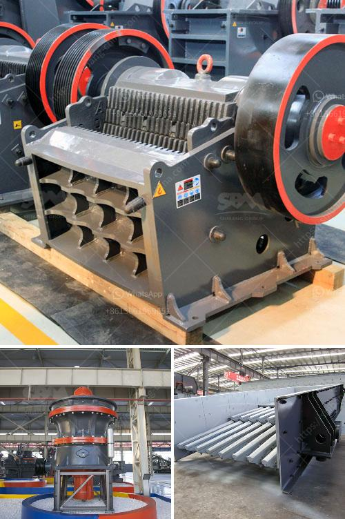

<h3>limestone crusher india</h3>
Limestone is a sedimentary rock that is primarily composed of calcium carbonate (CaCO3) in the form of the mineral calcite. It can be observed in various colors, including white, grey, and brown, depending on its impurities. Limestone is mainly used for construction purposes, as it serves as a building material and an ingredient in cement production. In India, limestone is widely available in abundance, making it a valuable resource.

One of the key equipment used by limestone processing industries is the limestone crusher. This crusher machine is used to crush the limestone into smaller particles for further processing. The limestone crusher is robust in design and built to withstand the toughest limestone crushing applications. It is constructed with heavy-duty components, such as the rotor, blow bars, and impact plates, which not only enhance its durability but also increase its crushing capacity.

India is a growing market for crushing equipment, primarily due to its bustling construction industry. With rapid urbanization and infrastructure development, the demand for limestone products is on the rise. Consequently, the demand for limestone crushers has also increased, leading to a surge in the production of these machines.

Several Indian manufacturers are engaged in the production of limestone crushers. These crushers are available in various models and sizes to cater to the specific requirements of different industries. The crushers are equipped with advanced technology, such as high crushing efficiency, easy operation, and maintenance, and environmental-friendly features. The availability of spare parts and after-sales service further strengthens the credibility of these crushers.

Moreover, India is the second-largest cement producer globally, driving the demand for limestone crushers in cement plants. With the government's focus on promoting infrastructure development and affordable housing, the demand for cement is expected to surge in the coming years, leading to an increase in demand for limestone crushers.

In conclusion, the limestone crusher industry in India is booming due to the expansion and growth of various sectors, such as construction, metallurgy, and cement industries. Increased government investment in infrastructure development and affordable housing projects is further fueling the demand for limestone products and, subsequently, limestone crushers. With robust construction and advanced technology, Indian limestone crushers are well-equipped to meet the growing demand and contribute to the development of the nation's infrastructure.
<h3>Contact us</h3><ul><li><strong>Whatsapp:&nbsp;<a href="https://wa.me/8613661969651">+8613661969651</a></strong></li><li><a href="https://swt.shibang-china.com/?git&amp;zhl&amp;limestone crusher india"><strong>Online Service(chat now)</strong></a></li></ul><h3>Related</h3><ul><li><a href='crusher plant layout.md'>crusher plant layout</a></li><li><a href='copper slag recycling plants china.md'>copper slag recycling plants china</a></li><li><a href='roller mill for powders.md'>roller mill for powders</a></li><li><a href='philippines stone crusher philippines.md'>philippines stone crusher philippines</a></li><li><a href='limestone crushing power consumption.md'>limestone crushing power consumption</a></li></ul>