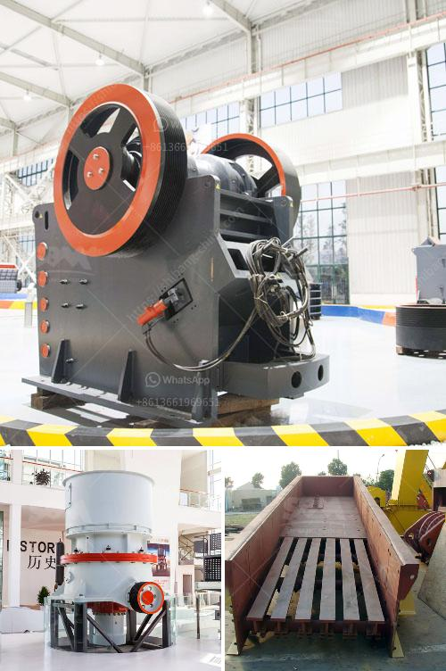

<h3>limestone crushing plant in india price</h3>
Limestone is an abundant rock found all over the world. The versatility and affordability of this mineral make it a popular choice for a wide range of applications. One of its key uses is in the construction industry, where it is used as a building material and aggregate for concrete. In India, limestone is abundantly available, and several limestone crushing plants are established all over the country. These plants ensure a steady supply of limestone for various construction needs.

Limestone crushing plants in India are built around some of the most advanced technologies and machinery available. Crushing machines such as jaw crushers, cone crushers, and impact crushers are deployed to get the desired sizes of limestone rock. These crushers work with the help of a hopper that feeds the larger pieces of limestone into the machine. Once crushed, smaller chunks go through different types of vibrating screens to achieve the desired size range. The final product is then sent to stockyards for distribution and sale.

The price of limestone crushing plants in India varies widely, depending on the size and capacity. However, what remains consistent is the quality of the end product. The crushers and screens are designed to hold up against the toughest limestone applications, ensuring reliability and high productivity. Moreover, these plants come equipped with dust suppression systems that minimize dust emissions, making them environmentally friendly.

In terms of price, a smaller limestone crushing plant can be purchased for as low as $500,000 USD. The price range increases with the size of the plant and its output capacity. However, even larger plants with a higher output capacity can be acquired at a reasonable price, considering the long-term benefits they bring. These plants not only ensure a consistent supply of limestone but also reduce transportation costs since limestone is readily available in India.

Investing in a limestone crushing plant in India is a great opportunity for both small and large companies. Limestone is an important resource for the construction industry and it greatly helps in improving the overall infrastructure of the country. The demand for limestone is expected to grow in the coming years, and having a crushing plant in place will offer a competitive advantage to any company.

Moreover, limestone crushing plants can also act as a source of employment, providing job opportunities to local communities. These plants require skilled workers for their operation and maintenance, thereby contributing to the socio-economic development of the region. Additionally, the crushed limestone produced can be used for various purposes, including road construction, concrete production, and agricultural applications.

In conclusion, investing in a limestone crushing plant in India offers significant benefits for companies operating in the construction industry. The availability of abundant and high-quality limestone in the country, along with advanced crushing technologies, makes it a cost-effective option. By acquiring a limestone crushing plant, companies can ensure a consistent and reliable supply of limestone, lower transportation costs, and contribute to the local economy. It is a win-win situation for both the industry and the country.
<h3>Contact us</h3><ul><li><strong>Whatsapp:&nbsp;<a href="https://wa.me/8613661969651">+8613661969651</a></strong></li><li><a href="https://swt.shibang-china.com/?git&amp;zhl&amp;limestone crushing plant in india price"><strong>Online Service(chat now)</strong></a></li></ul><h3>Related</h3><ul><li><a href='stone crusher uk.md'>stone crusher uk</a></li><li><a href='grinding mill machine in ethiopia.md'>grinding mill machine in ethiopia</a></li><li><a href='calcium carbonate machinery.md'>calcium carbonate machinery</a></li><li><a href='coal specifications for power plant.md'>coal specifications for power plant</a></li><li><a href='raymond mill price list.md'>raymond mill price list</a></li></ul>