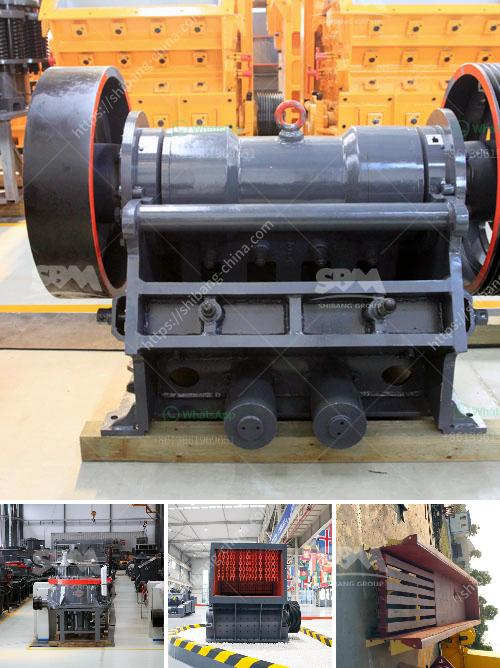

<h3>limestone crushing plant manufacturer</h3>
Limestone is a sedimentary rock that is mainly composed of calcium carbonate (CaCO3) in the form of calcite or aragonite. It is one of the most common rocks on Earth and can be found in various forms such as chalk, marble, and limestone itself. Limestone is widely used in several industries including construction, agriculture, and manufacturing.

To meet the growing demand for limestone, many companies are turning to limestone crushing plants. These plants specialize in crushing limestone rocks into smaller particles for various applications. The limestone crushing plant consists of jaw crusher, impact crusher, cone crusher, vibrating feeder, vibrating screen, and belt conveyor.

The capacity ranges from 50t/h to 500t/h. The output size can reach 10-350 mm, and the limestone raw materials are evenly fed by the vibrating feeder into the jaw crusher for primary crushing. After the primary crushing, the materials are conveyed into the impact crusher for secondary crushing, where they are further reduced in size. The vibrating screen separates the limestone particles into different sizes for the next stage of processing.

One of the leading limestone crushing plant manufacturers is AIMIX Group. We have rich experience in manufacturing and exporting high-quality limestone crushing plants to different countries. We can provide customized limestone crushing plants according to customers' specific requirements. Our limestone crushing plants are reliable, flexible, and efficient, which makes it ideal for various industries.

In addition to limestone crushing plants, we also have sand making plants, gravel plants, and quarry plants. Our limestone crushing plants contain more than 30% limestone particles, which can be used in road construction and other fields. The stone products produced by our limestone crushing plant are high-quality and able to meet the requirements of construction projects.

Overall, a limestone crushing plant manufacturer plays an important role in the production of high-quality limestone. The above-mentioned limestone crushing plant manufacturers provide the most advanced crushing technology and excellent service. With the continuous development of the limestone industry, more and more limestone crushing plant manufacturers are emerging, which provides more choices for users.
<h3>Contact us</h3><ul><li><strong>Whatsapp:&nbsp;<a href="https://wa.me/8613661969651">+8613661969651</a></strong></li><li><a href="https://swt.shibang-china.com/?git&amp;zhl&amp;limestone crushing plant manufacturer"><strong>Online Service(chat now)</strong></a></li></ul><h3>Related</h3><ul><li><a href='raymond mill price list.md'>raymond mill price list</a></li><li><a href='vertical roller grinding mill for sale.md'>vertical roller grinding mill for sale</a></li><li><a href='stone crusher price in australia.md'>stone crusher price in australia</a></li><li><a href='gypsum mining crusher in kenya manufacturer.md'>gypsum mining crusher in kenya manufacturer</a></li><li><a href='stone crusher for gravel.md'>stone crusher for gravel</a></li></ul>