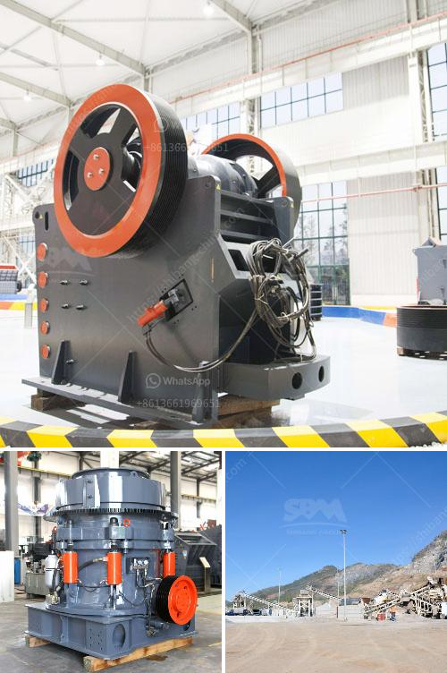

<h3>limestone crushing power consumption</h3>
Limestone, a sedimentary rock, is abundantly found all around the globe. Its high calcium content makes it an essential ingredient for the production of cement, lime, and various other industrial products. Limestone is generally crushed using a crusher to create a range of sizes suitable for various industries. However, the crushing process often requires significant energy, resulting in high power consumption. In this article, we will explore the factors contributing to limestone crushing power consumption.

One of the major contributors to power consumption in the crushing process is the size of the limestone particles. Larger particles require more energy to crush, resulting in high power consumption. Conversely, smaller particles require less energy for crushing, leading to reduced power consumption. Therefore, it is crucial to ensure that the limestone is appropriately sized before entering the crushing equipment. This can be achieved by pre-screening the limestone and segregating it into different size fractions.

In addition to particle size, the hardness of limestone also impacts power consumption during the crushing process. Harder limestone requires more energy to break, resulting in higher power consumption. On the other hand, softer limestone can be crushed with less energy, leading to reduced power consumption. Therefore, understanding the hardness of the limestone and selecting the appropriate crushing equipment is essential. Impact crushers are commonly used for crushing harder limestone, whereas jaw crushers are preferred for softer limestone.

Furthermore, the moisture content of limestone affects power consumption during the crushing process. Moisture acts as a lubricant between the particles, reducing the friction and making it easier to crush. Consequently, wet limestone requires less energy for crushing, leading to lower power consumption. However, high moisture content can also lead to clogging and decreased productivity. Therefore, it is crucial to carefully monitor and control the moisture content of limestone to optimize power consumption.

Another factor to consider is the type of crushing equipment used. Different crushers have varying power requirements, and selecting the right equipment can significantly impact power consumption. For instance, cone crushers are known for their high power consumption compared to impact crushers. Choosing the appropriate crushing equipment based on the specific requirements and characteristics of the limestone can help optimize power consumption.

Moreover, the operational parameters of the crushing equipment also influence power consumption. Factors such as the speed of rotation, feed rate, and the gap setting between the crushing surfaces can significantly impact power consumption. Striking the right balance between these parameters is crucial to ensure efficient crushing and minimize power consumption.

In conclusion, limestone crushing power consumption is a complex process influenced by various factors. Particle size, hardness, moisture content, crushing equipment type, and operational parameters all play significant roles in determining power consumption. By carefully considering these factors and optimizing the crushing process, the power consumption can be minimized, leading to cost savings and enhanced sustainability in limestone crushing operations.
<h3>Contact us</h3><ul><li><strong>Whatsapp:&nbsp;<a href="https://wa.me/8613661969651">+8613661969651</a></strong></li><li><a href="https://swt.shibang-china.com/?git&amp;zhl&amp;limestone crushing power consumption"><strong>Online Service(chat now)</strong></a></li></ul><h3>Related</h3><ul><li><a href='ball mill lining made in china.md'>ball mill lining made in china</a></li><li><a href='10 inches marble grinding stone.md'>10 inches marble grinding stone</a></li><li><a href='ballast crusher sale kenya.md'>ballast crusher sale kenya</a></li><li><a href='brick factory for sale in uk.md'>brick factory for sale in uk</a></li><li><a href='to choose jaw crusher.md'>to choose jaw crusher</a></li></ul>