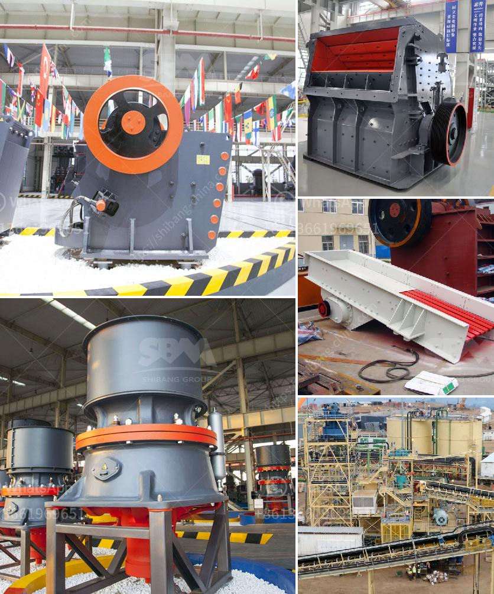

<h3>limestone field crushing plant</h3>
Limestone is a crucial material for building and construction purposes. Its versatility and durability make it an essential component in various infrastructure projects, including roads, highways, bridges, buildings, and more. To meet the increasing demand for limestone, a limestone field crushing plant plays a crucial role in extracting and processing this raw material efficiently.

A limestone field crushing plant is a facility that processes crushed limestone as the raw material for construction purposes. It typically consists of several crushing equipment, including jaw crushers, impact crushers, cone crushers, screens, and belt conveyors, all working together to produce the desired limestone sizes.

One of the main advantages of a limestone field crushing plant is its ability to produce limestone of different sizes. The crushed limestone can be further processed into various sizes, ranging from small granules to larger stones. These different sizes cater to different construction needs, whether it be for road base, concrete aggregate, or railway ballast.

Another benefit of a limestone field crushing plant is its mobility. Mobile crushing plants offer the flexibility to move from one site to another, allowing for on-site crushing where the limestone is extracted or near the construction project, significantly reducing transportation costs and saving time.

In addition to its cost-effective and time-saving benefits, a limestone field crushing plant also addresses environmental concerns. With advanced dust suppression systems and noise reduction techniques, modern crushing plants minimize pollution and ensure a safe working environment.

As the construction industry continues to expand globally, the demand for limestone to build roads, bridges, and buildings will remain high. A limestone field crushing plant plays a vital role in meeting this demand by efficiently processing and supplying high-quality crushed limestone. Its ability to produce various sizes and its mobility make it an indispensable component for any construction project. Moreover, with its focus on environmental sustainability, a limestone field crushing plant not only contributes to the development of robust infrastructure but also demonstrates a commitment to responsible construction practices.
<h3>Contact us</h3><ul><li><strong>Whatsapp:&nbsp;<a href="https://wa.me/8613661969651">+8613661969651</a></strong></li><li><a href="https://swt.shibang-china.com/?git&amp;zhl&amp;limestone field crushing plant"><strong>Online Service(chat now)</strong></a></li></ul><h3>Related</h3><ul><li><a href='vertical roller grinding mill for sale.md'>vertical roller grinding mill for sale</a></li><li><a href='tph rock crusher.md'>tph rock crusher</a></li><li><a href='coal and iron ore mining business plan pdf.md'>coal and iron ore mining business plan pdf</a></li><li><a href='calcium carbonate milling machine.md'>calcium carbonate milling machine</a></li><li><a href='feldspar refining and processing equipment.md'>feldspar refining and processing equipment</a></li></ul>