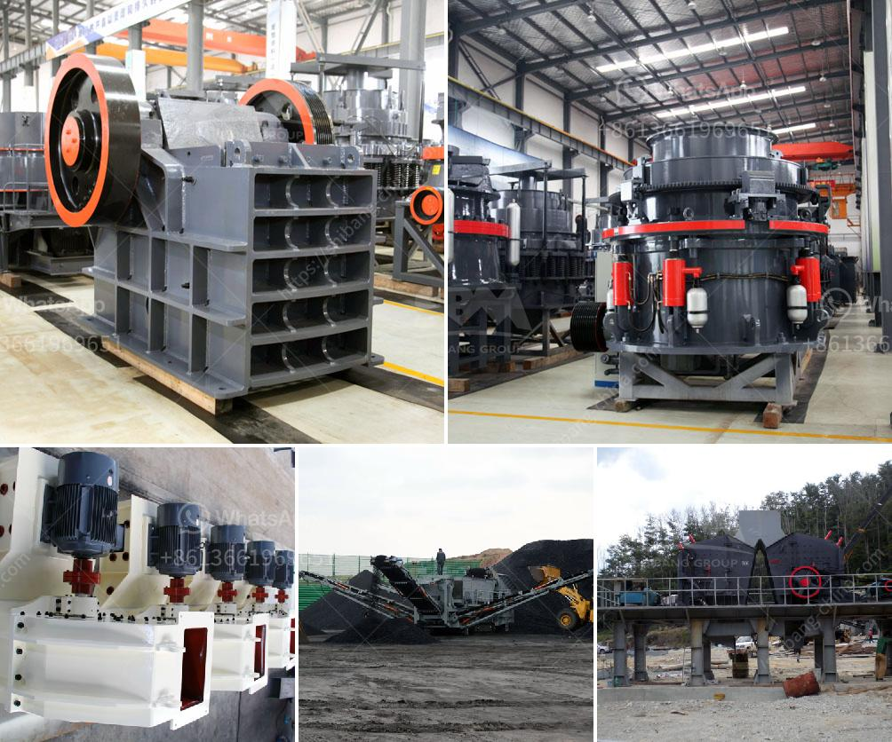

<h3>limestone grinding machine bangladesh</h3>
Limestone is a common rock found in nature that is primarily composed of calcium carbonate. It is an essential component in various industries such as construction, agriculture, and manufacturing. In order to obtain the desired particle size of limestone, it needs to be processed using a limestone grinding machine.

Bangladesh has abundant limestone resources, which is why the limestone grinding machine in Bangladesh is lower in production cost compared to other countries. However, there are still some challenges that manufacturers and suppliers face when producing and selling their limestone grinding machines in Bangladesh.

One major challenge is the lack of knowledge and understanding about the benefits of limestone grinding machines among local manufacturers and suppliers. Many may not be aware of the potential increase in productivity and efficiency that can be achieved by using these machines. Therefore, it is crucial to educate and provide training to manufacturers and suppliers about the advantages of using limestone grinding machines.

Another challenge is the availability of skilled labor to operate and maintain the limestone grinding machines. Skilled technicians and operators are required to ensure the smooth operation of these machines, as well as perform regular maintenance and repairs. Therefore, it is important to invest in training programs and skill development initiatives to address this issue.

The quality of limestone grinding machines available in the market is also a concern. It is crucial to ensure that the machines meet international standards and have a longer lifespan. This can be achieved by purchasing from reputable manufacturers and suppliers who have a proven track record in producing high-quality machinery.

In order to promote the use of limestone grinding machines in Bangladesh, it is necessary to create a favorable business environment. This can be done by providing incentives such as tax breaks, low-interest loans, and subsidies to manufacturers and suppliers. Additionally, the government can play a role in facilitating partnerships between local manufacturers and international machinery companies to promote technology transfer and exchange of expertise.

Lastly, it is important to promote the sustainable use of limestone grinding machines in Bangladesh. This can be achieved by encouraging manufacturers and suppliers to adopt environmentally friendly practices in the production and operation of these machines. For example, incorporating energy-saving features and using recycled materials in the manufacturing process can help reduce carbon emissions and conserve natural resources.

In conclusion, the limestone grinding machine has great potentials in Bangladesh due to the abundant limestone resources. However, there are challenges that need to be addressed to fully harness its benefits. These include the lack of knowledge and understanding about the advantages of using limestone grinding machines, the availability of skilled labor, the quality of machines, and the need for a favorable business environment. By addressing these challenges, Bangladesh can significantly improve the efficiency and productivity of its limestone industries while promoting sustainable development.
<h3>Contact us</h3><ul><li><strong>Whatsapp:&nbsp;<a href="https://wa.me/8613661969651">+8613661969651</a></strong></li><li><a href="https://swt.shibang-china.com/?git&amp;zhl&amp;limestone grinding machine bangladesh"><strong>Online Service(chat now)</strong></a></li></ul><h3>Related</h3><ul><li><a href='crusher equipment oman in oman.md'>crusher equipment oman in oman</a></li><li><a href='coal mining equipment coal mining equipment for sale.md'>coal mining equipment coal mining equipment for sale</a></li><li><a href='categories of conveyor belts.md'>categories of conveyor belts</a></li><li><a href='cone crusher 250tph.md'>cone crusher 250tph</a></li><li><a href='tph rock crusher.md'>tph rock crusher</a></li></ul>