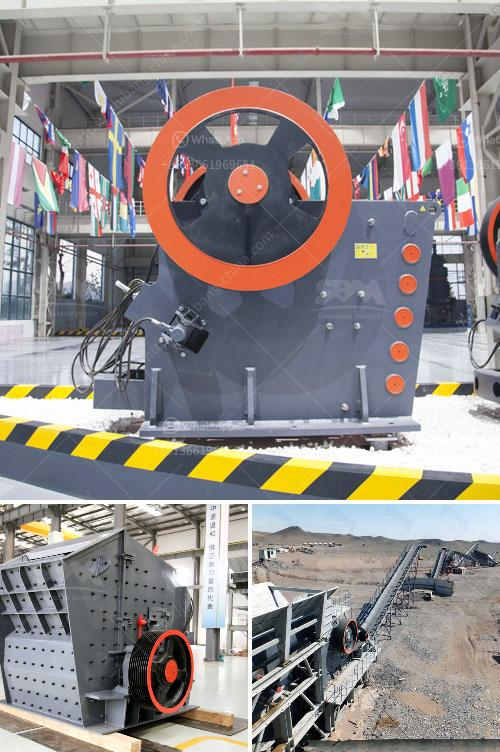

<h3>limestone grinding mill</h3>
Limestone is a sedimentary rock composed largely of the minerals calcite and aragonite, which are different crystal forms of calcium carbonate (CaCO3). Most limestone is composed of skeletal fragments of marine organisms such as coral, forams, and mollusks.

Limestone has numerous uses, including as building material, cement additive, and soil conditioner. It is also widely used in the construction industry for road construction, foundations, and building facades. In recent years, limestone grinding mills have gained immense popularity due to their ability to grind limestone into fine powder.

Limestone grinding mills are efficient, cost-effective, and versatile grinding machines that are used to grind and process limestone into fine powder. The main principle of operation of these mills is the production of a superfine powder that is accomplished by grinding limestone against itself. The limestone is put in a grinding mill, and the resulting powder is blown through a separator to separate any oversized particles.

One popular limestone grinding mill is the HGM series micro powder grinding mill, which is widely used in industries such as metallurgy, mining, chemical engineering, cement, construction, refractory materials, ceramics, and so on. It has numerous advantages compared to other grinding mills.

Firstly, the HGM series limestone grinding mill is highly efficient. It utilizes a unique grinding roller and grinding ring design that increases the grinding efficiency significantly. The limestone is ground by the grinding rollers and rings, and the material is ground to the desired fineness. The fineness can be adjusted from 325 mesh to 2500 mesh, depending on the application.

Secondly, the HGM series limestone grinding mill has a long lifespan. The grinding roller and grinding ring are made of special materials that are highly wear-resistant and durable. This ensures that the grinding mill can be used for a long time without the need for frequent maintenance or replacement of parts.

Thirdly, the HGM series limestone grinding mill is easy to operate. It has a user-friendly interface and is equipped with a control panel that allows the user to adjust the grinding parameters easily. The grinding mill can be operated automatically or manually, depending on the user's preference.

Lastly, the HGM series limestone grinding mill is environmentally friendly. It does not generate any dust or pollution during the grinding process, making it suitable for areas where environmental regulations are stringent. Additionally, the mill is equipped with a sound-proofing device, which reduces the noise generated during operation.

In conclusion, limestone grinding mills are efficient, cost-effective, and versatile machines that are used to grind limestone into fine powder. The HGM series limestone grinding mill is a popular choice for limestone grinding due to its many advantages, including high grinding efficiency, long lifespan, ease of operation, and environmental friendliness. Whether used in the construction industry or other industries, limestone grinding mills play a crucial role in processing limestone and meeting the needs of various applications.
<h3>Contact us</h3><ul><li><strong>Whatsapp:&nbsp;<a href="https://wa.me/8613661969651">+8613661969651</a></strong></li><li><a href="https://swt.shibang-china.com/?git&amp;zhl&amp;limestone grinding mill"><strong>Online Service(chat now)</strong></a></li></ul><h3>Related</h3><ul><li><a href='gold plant for sale in africa.md'>gold plant for sale in africa</a></li><li><a href='sand washing plants.md'>sand washing plants</a></li><li><a href='gyratory crusher price.md'>gyratory crusher price</a></li><li><a href='crushers and grinders mill.md'>crushers and grinders mill</a></li><li><a href='how to calculate cost per ton crusher aggregate.md'>how to calculate cost per ton crusher aggregate</a></li></ul>