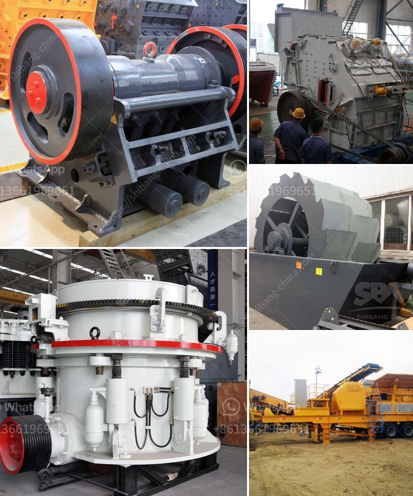

<h3>limestone jaw crusher sizes</h3>
Limestone is an important mineral resource, used in various applications such as construction, infrastructure development, agricultural soil improvement, and manufacturing of cement and other materials. To extract limestone from the mines, it is crushed into various sizes, including small aggregates for use in construction projects. One of the most commonly used crushers for limestone crushing is the jaw crusher.

The jaw crusher is an essential piece of equipment for limestone crushing, as it is responsible for breaking down the large rocks into smaller pieces. These smaller pieces are then further processed by other crushers, such as impact crushers and cone crushers, to achieve the desired granularities for various applications.

When it comes to jaw crushers, there are different sizes available for different crushing needs. The size of a jaw crusher is determined by the rectangular or square opening at the top of the jaws, known as the feed opening. For instance, a 24 x 36 jaw crusher has an opening of 24" by 36", a 56 x 56 jaw crusher has an opening of 56" square.

The choice of jaw crusher size is primarily determined by the feed material size and the desired product size. While larger feed openings can handle larger size feed materials, they are not suitable for achieving smaller product sizes. On the other hand, smaller feed openings can efficiently handle smaller size feed materials, but they may not be suitable for handling larger size rocks.

For limestone crushing, a jaw crusher with a feed opening size within the range of 300mm x 500mm is usually used. Larger feed sizes would require a larger feed opening size, resulting in increased cost and complexity of the crusher. Smaller feed sizes would not be efficiently processed by such a large jaw crusher, leading to reduced performance.

In addition to the feed opening size, other factors also affect the sizing of a jaw crusher. These include the stroke length, which is the distance that the movable jaw travels during one complete cycle of operation, and the closed-side setting, which is the narrowest distance between the fixed jaw and the movable jaw plates.

Considering all these factors, it is crucial to choose the right size of jaw crusher to ensure the efficient and effective crushing of limestone. A jaw crusher that is too small may not be able to handle larger size rocks, leading to jamming and reduced productivity. Conversely, a jaw crusher that is too large for the feed material may result in excessive wear, reduced efficiency, and increased operating costs.

In conclusion, the size of a limestone jaw crusher plays a crucial role in determining its suitability for various crushing applications. For limestone crushing, a jaw crusher with a feed opening size within the range of 300mm x 500mm is usually used. However, the actual selection should be based on the specific needs and requirements of each project, taking into consideration factors such as feed material size, desired product size, as well as the stroke length and closed-side setting of the jaw crusher.
<h3>Contact us</h3><ul><li><strong>Whatsapp:&nbsp;<a href="https://wa.me/8613661969651">+8613661969651</a></strong></li><li><a href="https://swt.shibang-china.com/?git&amp;zhl&amp;limestone jaw crusher sizes"><strong>Online Service(chat now)</strong></a></li></ul><h3>Related</h3><ul><li><a href='limestone milling machine made in russia.md'>limestone milling machine made in russia</a></li><li><a href='complete plant copper extraction processing for sale.md'>complete plant copper extraction processing for sale</a></li><li><a href='magnesite mining analysis south africa.md'>magnesite mining analysis south africa</a></li><li><a href='balls in cement grinding.md'>balls in cement grinding</a></li><li><a href='used ball mills philippines.md'>used ball mills philippines</a></li></ul>