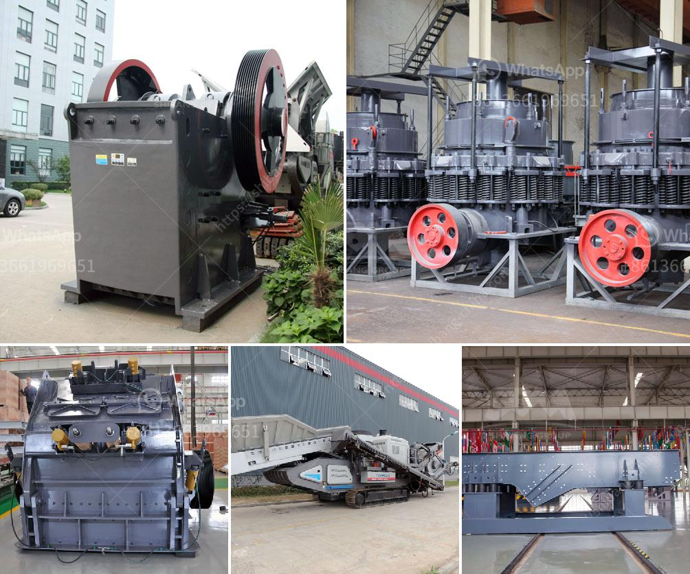

<h3>limestone milling machine made in russia</h3>
Limestone is a sedimentary rock that is primarily composed of calcium carbonate, which is found abundantly in the earth's crust. It has been used for centuries as a building material and is also a crucial ingredient in many industrial processes. To convert limestone into a fine powder, limestone milling machines are necessary. In Russia, there is a wide range of limestone milling machines available that are made with precision and quality.

Limestone milling machines made in Russia are widely utilized in limestone powder manufacturing processes, such as crushing, grinding, and classifying. The machines are available in various specifications to meet the diverse needs of customers. They are engineered with advanced technology and robust construction to ensure high performance and durability.

One of the key features of limestone milling machines made in Russia is their efficiency in grinding limestone into fine powder. The machines are equipped with powerful motors and sharp blades that crush and grind limestone with ease. This results in a high-quality end product that can be used in various applications, such as construction materials, chemical manufacturing, and agriculture.

Moreover, limestone milling machines made in Russia are designed to be user-friendly and convenient to operate. They come with user-friendly interfaces and controls that make it easy for operators to adjust the milling process according to their specific requirements. Additionally, the machines are equipped with safety features to ensure the safety of operators during operation.

In conclusion, limestone milling machines made in Russia are essential tools in the limestone powder manufacturing process. They offer high efficiency, reliability, and convenience to operators. With their advanced technology and robust construction, these machines are capable of producing high-quality limestone powder for various industries. Whether it is for construction, agriculture, or chemical manufacturing, these machines are a reliable choice for limestone milling operations.
<h3>Contact us</h3><ul><li><strong>Whatsapp:&nbsp;<a href="https://wa.me/8613661969651">+8613661969651</a></strong></li><li><a href="https://swt.shibang-china.com/?git&amp;zhl&amp;limestone milling machine made in russia"><strong>Online Service(chat now)</strong></a></li></ul><h3>Related</h3><ul><li><a href='raymond mill monterrey.md'>raymond mill monterrey</a></li><li><a href='small scale gold mining using stamp mill.md'>small scale gold mining using stamp mill</a></li><li><a href='sewa stone crusher di jakarta.md'>sewa stone crusher di jakarta</a></li><li><a href='dolomite refractory processing.md'>dolomite refractory processing</a></li><li><a href='brick factory for sale in uk.md'>brick factory for sale in uk</a></li></ul>